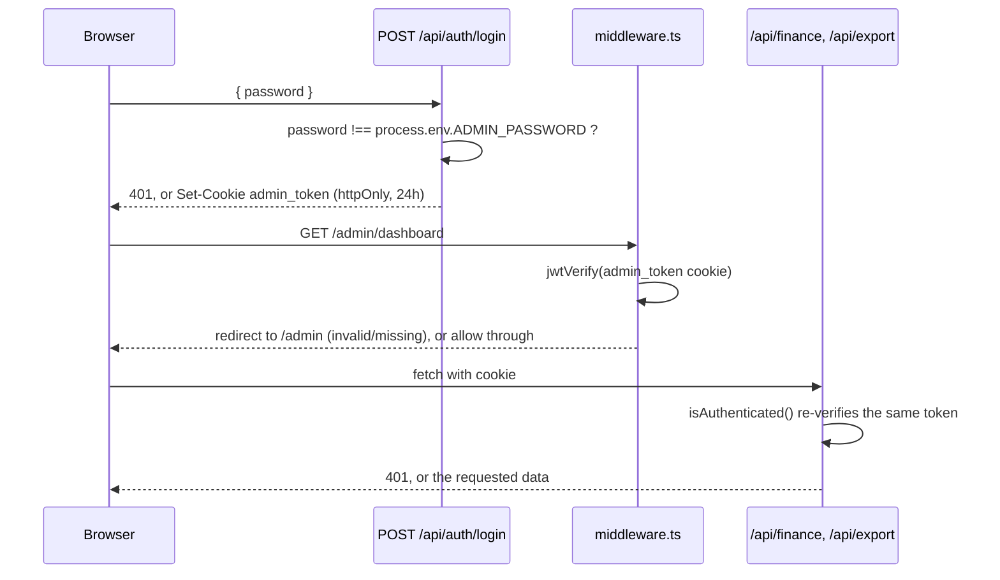

There's a single shared admin password (`ADMIN_PASSWORD`) - no username, no per-user accounts, no database-backed user table. Authentication is entirely a signed JWT stored in a cookie.

## `lib/auth.ts` - signing and verifying

`signToken(payload)` and `verifyToken(token)` wrap `jose`'s `SignJWT`/`jwtVerify` with a fixed `HS256` algorithm and a 24-hour expiration (`setExpirationTime('24h')`). The signing secret is `process.env.JWT_SECRET`, encoded via `TextEncoder`, with a hardcoded fallback string (`'fallback-secret'`) if the environment variable isn't set at all - meaning a deployment that forgets to configure `JWT_SECRET` would silently sign and verify tokens with a well-known constant string rather than failing to start.

## `app/api/auth/login/route.ts`

The entire login check is `password !== process.env.ADMIN_PASSWORD` - a direct string comparison, not a constant-time comparison and not a hashed-password check (see `01-overview.mdx` for the note on `bcryptjs` being unused). On success, it signs a token with `{ role: 'admin' }` as the only payload and sets it as an `httpOnly` cookie (`admin_token`), `secure` only in production, `sameSite: 'lax'`, 24-hour `maxAge`. `app/api/auth/logout/route.ts` just deletes that cookie.

## `middleware.ts` - the page-level gate

Next.js middleware, matched only against `/admin/dashboard/:path*` (via the exported `config.matcher` - notably **not** matching `/api/finance/*` or `/api/export`, which each protect themselves independently instead, see below). It reads the `admin_token` cookie, and if missing or if `jwtVerify` throws, redirects to `/admin`; otherwise lets the request through. This only gates the page shell - it doesn't gate the data.

## Every API route re-checks auth independently

`app/api/finance/route.ts`, `app/api/finance/[id]/route.ts`, and `app/api/export/route.ts` each define their own **identical, copy-pasted** `isAuthenticated(req)` helper function (reads the `admin_token` cookie, calls `verifyToken`, returns whether the payload came back truthy) rather than importing one shared implementation from `lib/auth.ts`. This means the actual data-protecting check lives in three separate places that all happen to agree today, but aren't guaranteed to stay in sync if the auth logic ever needs to change - a fourth, shared `requireAuth`-style helper in `lib/auth.ts` (alongside the existing `signToken`/`verifyToken`) would remove this duplication.
