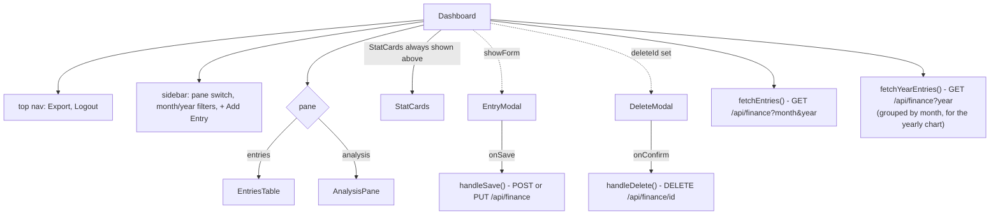

`app/admin/dashboard/page.tsx` (780 lines) is one large client component (`Dashboard`) composed of about a dozen smaller components defined in the same file - none of these are split into `components/` (there's no `components/` folder in this project at all; everything lives inline in the two `app/admin/**/page.tsx` files).

## State and data fetching

`Dashboard` owns: `month`/`year` (filter selection, defaulting to the current month/year), `entries` (the currently-filtered list), `allEntries` (a `{ "year-month": Entry[] }` cache built up across every year/month the person has viewed, used only to feed the "Monthly Breakdown" yearly chart without needing a separate year-wide endpoint), `pane` (`"entries"` | `"analysis"`), `sidebarOpen` (mobile only), and the add/edit/delete modal state (`showForm`, `editTarget`, `deleteId`).

Two `useCallback`-wrapped fetchers run in `useEffect`s keyed to `month`/`year`: `fetchEntries` (the filtered list for the current pane) and `fetchYearEntries` (every entry for the selected year, regrouped client-side by month into `allEntries`) - both re-run whenever `month`/`year` changes, and are re-triggered explicitly after any save/delete so the UI reflects the change without needing a full page reload. A `401` response from `fetchEntries` redirects straight to `/admin` (the middleware already blocks the page shell, but the dashboard's own data fetch is a second line of defense in case the cookie expires mid-session).

## `StatCards`

A 7-card row (Photo/Photocopy/Mobile/Other/Expenses/Total Income/Net Profit) computed from `getTotals(entries)`, always shown above whichever pane is active. Net Profit's color flips between the amber accent and red depending on sign.

## `EntriesTable` (the "entries" pane)

A sortable-by-nothing (always `date DESC` from the API), fixed-column table: one row per entry via `TableRow` (hover-revealed Edit/Del buttons), a footer row summing every numeric column across the currently-filtered entries. Empty state renders a single "No entries for this period" row.

## `AnalysisPane` (the "analysis" pane)

Four `chart.js` charts via `react-chartjs-2`, all sharing a common dark-theme options object (`baseOpts`/`yAxis`/`xAxis`/`TOOLTIP_CFG`):

- **Daily Profit Trend** - `Line` chart of net profit per entry in the selected month, filled area under the line
- **Category Income - Month** - `Doughnut` chart of the four income categories' share of the month's total, with a manual percentage legend beside it (not `chart.js`'s built-in legend, which is disabled everywhere via `legend: { display: false }`)
- **Income vs Expenses - Daily** - grouped `Bar` chart, one pair of bars per entry in the month
- **Monthly Breakdown - `<year>`** - grouped `Bar` chart across all 12 months of the selected year, sourced from `allEntries` rather than `entries`, so it reflects the whole year regardless of which month is currently filtered

Each chart's container (`ChartCard`) shows an empty-state message instead of an empty chart if there's no data for it specifically (e.g. the doughnut chart checks `dTotal === 0` independently of whether the line/bar charts have data).

## `EntryModal` (add/edit)

A single form (reused for both "New Entry" and "Edit Entry" based on whether `initial.id` is set) with a date picker, five numeric category inputs in a 2-column grid, and a notes text field. Submitting calls `onSave` (wired to `handleSave` in `Dashboard`), which `POST`s to `/api/finance` for a new entry or `PUT`s to `/api/finance/[id]` for an edit, then closes the modal and re-runs both fetchers.

## `DeleteModal`

A plain confirm/cancel dialog - no "type the entry's date to confirm" friction, just two buttons.

## Responsive sidebar

Same fixed-`id` + `<style>` media-query pattern as the public site (`02-public-site.mdx`): on screens ≤768px, the sidebar becomes a `position: fixed` off-canvas panel toggled by a hamburger button, sliding in via a CSS `transform: translateX(...)` transition rather than conditionally mounting/unmounting it.
