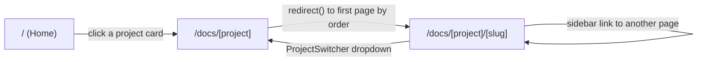

Three routes, all Server Components (no `"use client"` at the page level - interactivity lives entirely in the client components they render, see `05-interactive-components.mdx`).

## `/` - `app/page.tsx`

Calls `getProjects()` and renders one card per project (label, description, a page count via `getProjectPages(project.slug).length`), linking each to `/docs/<slug>`. No pagination, no search - just the flat list, sorted by `order`.

## `/docs/[project]` - `app/docs/[project]/page.tsx`

A pure redirect route with no UI of its own:

1. `getProject(projectSlug)` - if it returns `undefined` (unknown project slug), calls `notFound()`.
2. `getProjectPages(projectSlug)` - if this is an empty array (a project with a `meta.json` but no `.mdx` files yet), also calls `notFound()`.
3. Otherwise, `` redirect(`/docs/${projectSlug}/${pages[0].slug}`) `` - straight to the first page by `order`.

This means `/docs/<project>` is never itself a page a person lands on and stays at; it always immediately becomes `/docs/<project>/<first-page-slug>`.

## `/docs/[project]/[slug]` - `app/docs/[project]/[slug]/page.tsx`

The actual doc page. `generateStaticParams` returns `getAllProjectSlugPairs()`, so every `{project, slug}` combination that exists under `content/` at build time is statically generated rather than rendered on demand. At request/build time, the page:

1. Resolves `project` via `getProject`, `notFound()` if missing.
2. Resolves the page's raw content via `getPageSource(projectSlug, slug)`, `notFound()` if missing (covers both an unknown project *and* a known project with no page matching that slug).
3. Computes `pages` (the full sidebar list), `pageIndex` (this page's position in that list - computed but only used to look up the current page's `title` for the breadcrumb and `<h1>`, not for a prev/next pager; there is no "next page" / "previous page" navigation UI anywhere in this app, only the sidebar tree).
4. Extracts `##`-level headings from the raw MDX via `extractHeadings` (`lib/toc.ts`) to feed `TocRail`.
5. Renders the shared chrome (`TopBar`, `MobileSidebar`, `DocsSidebar`, `TocRail`) around `MdxContent`, which does the actual MDX-to-React compilation (see `04-mdx-rendering.mdx`).

## 404 handling

There's no custom `not-found.tsx` in this project, so an unknown project slug, an unknown page slug within a known project, or a project with zero pages all fall through to Next.js's default not-found page via the `notFound()` calls described above - there's no dedicated "did you mean...?" or search fallback.
