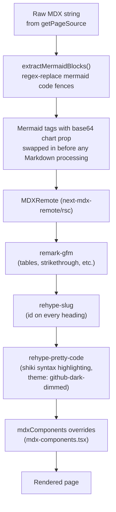

`components/MdxContent.tsx` is the single place raw MDX text becomes rendered React output, using `next-mdx-remote/rsc` (the React Server Component entry point - MDX is compiled on the server, not shipped to the client as source).



## Why Mermaid blocks are pulled out before anything else runs

`extractMermaidBlocks` regex-matches every fenced ` ```mermaid ` block in the raw MDX string and replaces it with a `<Mermaid chart="..." />` tag **before** the string is ever handed to `MDXRemote`. This has to happen first: if a mermaid code fence were left as a normal fenced code block, `rehype-pretty-code` would tokenize and syntax-highlight it into a tree of `<span>` elements for display, which destroys it as parseable diagram source - `mermaid.js` needs the plain, untouched diagram text.

The diagram source is embedded as a **base64-encoded plain JSX attribute** (`chart="aGVsbG8..."`) rather than a JS expression container or the raw un-encoded text. The code comment in `MdxContent.tsx` explains why directly: passing a raw string through an expression container silently drops the prop somewhere in this MDX/JSX pipeline (the component receives an empty props object, no `chart` key at all) - a quoted plain attribute works, and base64 has no quote or angle-bracket characters that could break out of that attribute, so it's a safe encoding for arbitrary diagram text (including text containing literal quote or angle-bracket characters) either way.

## Plugin pipeline

Configured entirely inside `MdxContent`'s `MDXRemote` call:

- **`remark-gfm`** - GitHub-Flavored Markdown: tables, strikethrough, task lists, autolinks. This is what makes every file-reference table across `content/`'s project docs render as an actual table.
- **`rehype-slug`** - adds an `id` attribute to every heading based on its text, which is what makes anchor links (and the TOC rail's links) actually land on the right element.
- **`rehype-pretty-code`** - syntax-highlights fenced code blocks via `shiki`, using the `github-dark-dimmed` theme with `keepBackground: false` (so the code block's background comes from this site's own CSS rather than whatever background color the Shiki theme itself specifies).

## `##`-heading extraction vs. `rehype-slug`'s IDs: two independent slugifiers

`lib/toc.ts`'s `extractHeadings` runs a completely separate, hand-written regex pass over the *raw* MDX text (matching lines starting with `## `) and its own hand-written `slugify` function to guess each heading's `id`, entirely independent of `rehype-slug`'s actual ID-generation logic (which runs later, inside the MDX compile step, and is based on the `github-slugger` package under the hood). In the normal case both produce the same slug for a given heading text, which is why the TOC rail's guessed-id links correctly land on the corresponding real heading. But because these are two separate implementations, they could diverge for edge cases `rehype-slug`/`github-slugger` handles specially - most notably **duplicate heading text within one page**, which `github-slugger` de-duplicates by appending `-1`, `-2`, etc. to repeats, while `lib/toc.ts`'s `slugify` has no such de-duplication logic at all and would produce the same id for every occurrence.

> ⚠️ Unclear: whether this has caused a visible mismatch anywhere in the current `content/` tree wasn't checked page-by-page - it would only surface on a page with two identically-worded `##` headings.

## Custom component overrides (`components/mdx-components.tsx`)

Passed to `MDXRemote` as `components`, these override how standard Markdown elements render:

- **Headings (`h1`/`h2`/`h3`)** - the site's display type scale (`font-display`, which resolves to Fira Code per the styling system - see `06-styling-system.mdx`); `h2`/`h3` get `scroll-mt-20` so jumping to an anchor link doesn't tuck the heading under the sticky `TopBar`.
- **`p`/`ul`/`ol`/`li`** - consistent muted body-text color (`text-n-300`) and line-height across every project's docs, regardless of what each `.mdx` file's own prose looks like.
- **`a`** - underlined with a muted decoration color that brightens on hover, rather than the browser default blue/purple link colors (which wouldn't fit the neutral-only palette anyway).
- **`code`** - inline code gets a subtle background pill; this only affects *inline* code, since fenced code blocks are handled by `rehype-pretty-code` and the `figure` override below instead.
- **`table`/`thead`/`th`/`td`** - wrapped in a horizontally-scrollable container with a `min-width` floor, so a wide reference table (like the file-reference tables at the end of most project docs) doesn't break the page layout on narrow viewports - it scrolls sideways within its own box instead.
- **`blockquote`** - the single most structurally significant override: every Markdown blockquote is replaced with a styled callout box (a left accent border, muted background, and a `lucide-react` `Info` icon) rather than the default indented-quote styling. This is the mechanism behind every "unclear" note across this project's documentation - from the reader's perspective it renders as a distinct "note" callout, not as a quotation.
- **`figure`** - `rehype-pretty-code` wraps every code block in a figure element; this override gives that figure the site's card styling (background, border, rounded corners, horizontal scroll for long lines) so code blocks look consistent with the rest of the UI.
- **`Mermaid`** - registered here as a plain component reference so that the tags produced by `extractMermaidBlocks` resolve to the actual component (see `05-interactive-components.mdx`) rather than being treated as an unknown/undefined JSX tag.
