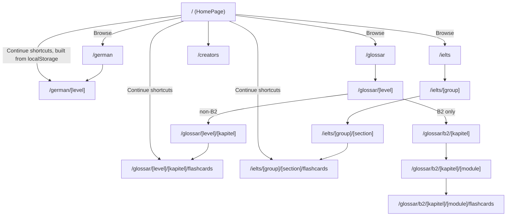

Every screen is a Next.js App Router page under `app/`, each starting with `"use client"` since every page reads from `localStorage`/`ThemeContext` and needs browser APIs. There's no shared root template beyond `app/layout.tsx` (which just loads the JetBrains Mono font via a `<link>` tag and wraps everything in `ThemeProvider`) - no persistent nav bar or tab strip; each page renders its own `NavBar`.



## Route tree

```text
app/
├── page.tsx                                    →  /                       (home: three module cards)
├── creators/page.tsx                           →  /creators               (credits + other projects)
├── german/
│   ├── page.tsx                                →  /german                 (level picker: A1/A2/B1)
│   └── [level]/page.tsx                        →  /german/[level]         (swipe game for one level)
├── glossar/
│   ├── page.tsx                                →  /glossar                (level picker: A1/A1_OLD/A2/B1/B2)
│   ├── [level]/
│   │   ├── page.tsx                            →  /glossar/[level]                  (Kapitel list, non-B2)
│   │   └── [kapitel]/
│   │       ├── page.tsx                        →  /glossar/[level]/[kapitel]              (word list)
│   │       └── flashcards/page.tsx             →  /glossar/[level]/[kapitel]/flashcards
│   └── b2/
│       └── [kapitel]/
│           ├── page.tsx                        →  /glossar/b2/[kapitel]                     (Module list)
│           └── [module]/
│               ├── page.tsx                    →  /glossar/b2/[kapitel]/[module]              (word list)
│               └── flashcards/page.tsx         →  /glossar/b2/[kapitel]/[module]/flashcards
└── ielts/
    ├── page.tsx                                →  /ielts                  (section-group picker)
    └── [group]/
        ├── page.tsx                            →  /ielts/[group]                (category list within a group)
        └── [section]/
            ├── page.tsx                        →  /ielts/[group]/[section]              (word/question list)
            └── flashcards/page.tsx             →  /ielts/[group]/[section]/flashcards
```

This mirrors the mobile app's screen structure one-for-one, just with each dynamic segment (`[level]`, `[kapitel]`, `[module]`, `[group]`, `[section]`) as its own folder rather than a filename, and every leaf `.../index.tsx`-equivalent named `page.tsx` per Next.js App Router convention.

`useParams` reads the dynamic segments and `useSearchParams` reads query params on every screen that needs them.

## B2's split from the rest of Glossar

`/glossar/[level]/page.tsx` checks `isB2Level(level)` (`hooks/useGlossarData.ts`) and routes each Kapitel row to either `/glossar/b2/[kapitel]` or `/glossar/[level]/[kapitel]` accordingly - B2 is the only level with a Module layer between Kapitel and words, so it gets its own route sub-tree with an extra segment, same as the mobile app.

## Deep-linking a resume position

Every flashcards route reads an optional `?start=` query param to seed its `index` state, and the Deutsch Artikel game route additionally reads `?resumeIndex=`, `?resumeScore=`, and `?resumeStreak=` (all three, since resuming a German level needs to restore score/streak too, not just position). List screens and the home page build these query strings directly from values read out of `localStorage` (see `04-progress-and-persistence.mdx`) when rendering their "Continue" buttons.

## No custom 404 handling

There is no `not-found.tsx`. For an unrecognized `[level]`/`[kapitel]`/`[module]`/`[group]`/`[section]` value, the relevant hook's loader map lookup (see `03-vocabulary-data.mdx`) resolves to `undefined`, and every loader function returns `[]`/`null` from that case rather than throwing - so the screen renders its own "no words found"/"no cards found" empty state instead of a distinct error page.
