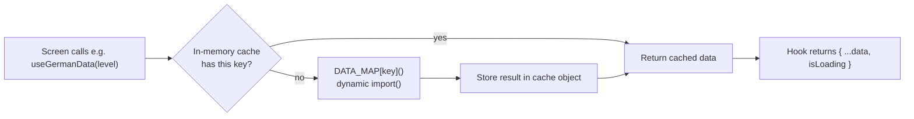

All content is static JSON under `data/`, loaded through per-key `() => import("../data/<file>.json")` maps - the same loader-map-plus-cache shape across all four hooks, differing from the mobile app mainly in that every loader here is asynchronous (`Promise`-returning dynamic `import()`) rather than a synchronous `require()`, so Next.js can code-split each level/Kapitel/section/topic into its own separately-fetched chunk instead of bundling all vocabulary data into the initial page load.

## File-naming convention

| Module | File pattern | Example |
| --- | --- | --- |
| Deutsch Artikel | `german_<LEVEL>.json` | `german_A1.json` |
| Deutsch Glossar (non-B2) | `glossar_<LEVEL>_K<N>.json` | `glossar_A2_K7.json` |
| Deutsch Glossar (B2 Kapitel meta) | `glossar_B2_K<N>_meta.json` | `glossar_B2_K3_meta.json` |
| Deutsch Glossar (B2 Module words) | `glossar_B2_K<N>_M<M>.json` | `glossar_B2_K3_M2.json` |
| IELTS vocabulary | `ielts_<GROUP><LETTER>.json` | `ielts_2C.json` |
| IELTS speaking | `ielts_speaking_<CODE>.json` | `ielts_speaking_5AJ.json` |

## Per-hook shapes

**`hooks/useGermanData.ts`** - `GERMAN_DATA_MAP` has 3 entries (`A1`, `A2`, `B1`); `AVAILABLE_GERMAN_LEVELS` is `Object.keys(GERMAN_DATA_MAP)`. Each file is a `GermanLevelData`: `{ level, words: GermanWord[] }`, where each `GermanWord` has `id`, `word`, `artikel` (`"der" | "die" | "das"`), `meaning`. `getGermanLevelWords(level)` returns the raw word array (unshuffled); `shuffleGermanWords` is a separately-exported Fisher-Yates helper the caller applies itself - `useGermanData(level)` (the hook) shuffles internally on every load, while the German game screen (`/german/[level]`) calls `getGermanLevelWords` + `shuffleGermanWords` directly so it can re-shuffle again on "Play again" without a fresh network/import round-trip (the module-level `levelCache` object means a second `loadLevel` call for the same level resolves instantly).

**`hooks/useGlossarData.ts`** - the largest of the four, covering three related but distinct data shapes:

- Non-B2 Kapitel: `GLOSSAR_DATA_MAP` has one entry per `<LEVEL>_K<N>` combination (56 entries covering A1, A1_OLD, A2, and B1, 12 Kapitel each). `GlossarKapitelData` is `{ level, kapitel, moduleId?, words: GlossarWord[] }`; `GlossarWord` is `{ id, word, plural?, meaning, example? }`.
- B2 Kapitel meta: `GLOSSAR_B2_META_MAP` has 10 entries (`"1"`-`"10"`), each a `GlossarB2MetaData` (`{ level: "B2", kapitel, modules: GlossarB2Module[] }` where `GlossarB2Module` is `{ id, title }`).
- B2 Module words: `GLOSSAR_B2_MODULE_MAP` has 40 entries (`"K<N>_m<M>"`), each a plain `GlossarKapitelData` again (reusing the same `words: GlossarWord[]` shape as non-B2).

`GLOSSAR_LEVELS` (`["A1", "A1_OLD", "A2", "B1", "B2"]`), `GLOSSAR_KAPITEL_COUNT` (12 for every level except B2's 10), `GLOSSAR_LEVEL_LABELS` (only `A1_OLD` gets a friendlier display label, `"A1 (old)"`, via `getGlossarLevelLabel`), and `isB2Level` all live in this same file and back the level-picker and Kapitel-list screens.

**`hooks/useIELTSData.ts`** - `IELTS_DATA_MAP` has 23 entries across groups 1-4. Each file is an `IELTSSectionData`: `{ section, title, words: IELTSWord[] }`, where `IELTSWord` has `id`, `word`, `type`, `category`, `meaning`, `example`, `synonyms: string[]`, `antonyms: string[]`. `IELTS_SECTION_GROUPS` is a hardcoded array of 5 groups (4 vocabulary groups plus group `"5"`, Speaking Topics, whose `categories` list all 61 speaking section codes even though those codes resolve through the *other* hook). `getSectionGroupId(section)` extracts the leading digit(s) of a section code via regex, falling back to `"1"` - used by the home page to build a correct `/ielts/[group]/[section]` deep link from just a saved section code.

**`hooks/useIELTSSpeakingData.ts`** - `IELTS_SPEAKING_DATA_MAP` has 61 entries (`5A` through `5BF`). Each file is an `IELTSSpeakingTopicData`: `{ section, title, questions: IELTSSpeakingQuestion[] }`, where `IELTSSpeakingQuestion` has `id`, `part` (`1 | 2 | 3`), `question`, an optional `cueCardPoints: string[]` (only Part 2 "cue card" questions have this), and `answer` (an example response). `isIELTSSpeakingSection(code)` is just `code in IELTS_SPEAKING_DATA_MAP` - this is the single check every IELTS screen uses to decide whether a given section code should render as vocabulary (`FlashCard`) or speaking (`SpeakingCard`) content.

## Caching

Every hook keeps its own module-level plain-object cache (`levelCache`, `kapitelCache`, `b2MetaCache`, `b2ModuleCache`, `sectionCache`, `speakingCache`) keyed by the same string keys as its `DATA_MAP`. Because these are module-level (not component state), a chunk is only ever dynamically imported once per page-load session, no matter how many components request the same level/Kapitel/section across navigations.

## Unknown keys resolve to empty, not an error

Every `get...` function follows the same guard: look up the key in its `DATA_MAP`; if the loader function isn't there, return `[]` (or `null` for the B2 meta lookup) without attempting an import. This is what backs the "no words found"/"no cards found" empty states referenced in `02-navigation-and-routing.mdx` rather than a thrown error or a Next.js 404.
