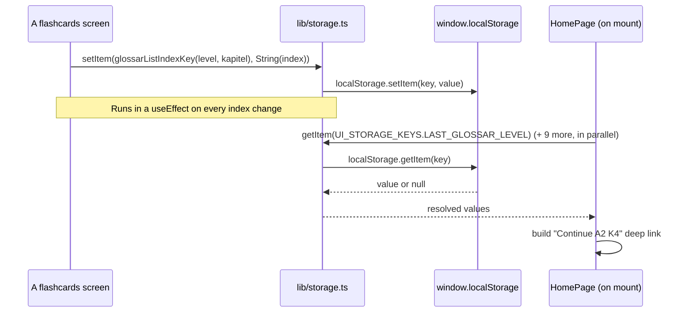

There's no backend and no account - everything that survives a page reload lives in the browser's `localStorage`, accessed only through `lib/storage.ts`, a tiny async-looking wrapper (`getItem`/`setItem`/`removeItem`, each returning a `Promise`) that mirrors the shape of React Native's `AsyncStorage` API. Every screen and hook that touches storage calls this wrapper, never `window.localStorage` directly - and the wrapper itself guards every call with `typeof window !== "undefined"` and a `try/catch`, so it's safe to call during server rendering or if storage is unavailable (e.g. private browsing with storage disabled) - it just silently no-ops instead of throwing.

## Score tracking (German Artikel only)

`store/progressStore.ts` defines a single storage key, `cards_german_progress` (`STORAGE_KEYS.GERMAN_PROGRESS`), holding a JSON-serialized `GermanProgressMap` - `{ [wordId]: { correct, incorrect } }` across every German word ever answered, independent of level.

`hooks/useProgress.ts` loads this map once on mount and exposes:

- `recordGermanAnswer(id, wasCorrect)` - merges one word's result into the map (via `germanProgress[id] ?? { correct: 0, incorrect: 0 }` as the base), updates React state, and immediately persists the whole map back to storage.
- `getGermanScore(level, levelWordIds)` - reduces the map down to just the IDs passed in, used by both the German level-picker (`/german`, to show a per-level accuracy percentage) and the game screen itself.

Only Deutsch Artikel tracks correct/incorrect scoring - Glossar and IELTS are flip-to-reveal review formats with no right/wrong concept, so they only ever track review *position*.

## "Continue where you left off"

`store/uiStore.ts` defines two kinds of resume state, exactly mirroring the pattern documented for the mobile app:

**Fixed keys** (`UI_STORAGE_KEYS`) - one "last used" slot per module, written by each flashcards/game screen's own `useEffect` whenever its `index` (and, for German, `score`/`streak`) changes:

| Key | Written by |
| --- | --- |
| `cards_ui_last_ielts_section`, `cards_ui_last_ielts_index` | `/ielts/[group]/[section]/flashcards` |
| `cards_ui_last_german_level`, `..._index`, `..._score`, `..._streak` | `/german/[level]` |
| `cards_ui_last_glossar_level`, `..._kapitel`, `..._module`, `..._index` | `/glossar/[level]/[kapitel]/flashcards` and its B2 equivalent |

The home page (`app/page.tsx`) reads all ten of these in parallel (`Promise.all`) on mount to render each module's "Continue ..." button, and builds the right deep link per module - notably branching the Glossar continue-link on whether `glossarModule` is set, to decide between the B2 (`/glossar/b2/[kapitel]/[module]/flashcards`) and non-B2 (`/glossar/[level]/[kapitel]/flashcards`) path.

**Per-list keys** (`ieltsListIndexKey(section)`, `glossarListIndexKey(level, kapitel, moduleId?)`) - functions that build one unique key per section/Kapitel/Module (e.g. `cards_ui_glossar_list_index_B2_3_m2`), read independently by each word-list screen (not the flashcards screen) to decide whether to show a plain "Start" action or a "Continue (word `N`)" one for that specific list, without disturbing the module-wide fixed-key state used by the home page.

Every Glossar flashcards screen writes both the per-list key *and* the fixed `UI_STORAGE_KEYS` in the same `useEffect`, and explicitly `removeItem`s `LAST_GLOSSAR_MODULE` (non-B2) or presumably sets it (B2, by symmetry with the mobile app's pattern) - this is how the home page's Glossar continue button knows whether it's resuming into the B2 sub-tree or not.

> ⚠️ Unclear: the B2 flashcards screen (`app/glossar/b2/[kapitel]/[module]/flashcards/page.tsx`) was not read in full detail for this page - its handling of `LAST_GLOSSAR_MODULE` is inferred by symmetry with the non-B2 screen's explicit `removeItem` call and the home page's branch on `glossarModule`, not directly confirmed line-by-line.

## Theme persistence

Light/dark mode is stored under its own separate key, `cards_theme_mode`, inside `theme/ThemeContext.tsx` - see `05-interaction-and-theming.mdx`.

## No "finished" state persistence

Reaching the end of a deck (German's "Deck complete" screen, Glossar's "Kapitel complete" screen) is pure component state - `index >= words.length` - computed fresh from the already-persisted `index` and word-count each time, not a separate stored "completed" flag.
