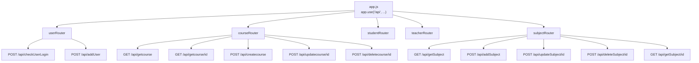

`backend/app.js` mounts all 5 routers under a shared `/api` prefix, with each router owning its own path segment naming rather than a nested `/api/courses`-style resource prefix per router.

## Consistent (if non-RESTful) route conventions

All four resource routers (course/student/teacher/subject) follow the same pattern: `GET` for list and get-by-id, but **`POST` for both update and delete** rather than `PUT`/`PATCH`/`DELETE`. This is consistent across every resource, so it reads as a deliberate simplification rather than an oversight - but it does mean nothing in this API is cacheable/idempotent-by-method the way a REST-conventional API would be, and any tooling that assumes standard HTTP verbs for updates/deletes (API gateways, some client libraries' built-in CRUD helpers) won't work against this API without adaptation.

## Naming: three routers lowercase, one camelCase

`courseRouter.js`, `studentRouter.js`, and `teacherRouter.js` all register their paths in all-lowercase (`/getcourse`, `/createstudent`, `/updateteacher/:id`, etc.). `subjectRouter.js` alone uses camelCase (`/getSubject`, `/addSubject`, `/updateSubject/:id`, `/deleteSubject/:id`, `/getSubject/:id`). Because Express routing is case-sensitive by default, this inconsistency is exactly what breaks the frontend's Subjects feature - see `01-overview.mdx` and `04-frontend-app.mdx` for the full trace.

## Handler pattern

Every handler in `backend/components/*.js` follows the same shape: a raw parameterized SQL string (via `mysql2`'s `?` placeholders, which protects against SQL injection), a `db.query(sql, params, callback)` call, and a callback that either sends a `500` with the raw MySQL error (inconsistently `.send(error)` in `user.js` versus `.json({ error: "..." })` everywhere else, though both produce a usable JSON body via Express's default serialization) or the successful result. Whether a "not found" case is checked at all is inconsistent across resources: `course.js`'s `getCourseById`/`updateCourse`/`deleteCourse` and `teacher.js`'s `getTeacherById`/`updateTeacher`/`deleteTeacher` correctly check `result.length === 0`/`result.affectedRows === 0` and return a `404`, but `student.js`'s `updateStudent`/`deleteStudent` and `subject.js`'s `updateSubject`/`deleteSubject` don't check `affectedRows` at all - updating or deleting a nonexistent student or subject `id` still returns a `200` "successfully updated/deleted" response even though no row was actually touched.

## No request body validation

None of the handlers validate that the expected fields (`name`, `email`, `fees`, `code`, etc.) are present, non-empty, or the right type before passing them into a SQL query - a request missing a required field would either insert `undefined`/`null` into MySQL (which may or may not be rejected depending on the table's own column constraints, none of which are visible in this repo - there's no `.sql` schema file checked in) or produce a MySQL-level error surfaced as a raw `500`.

## `user.js` - the only file with any auth-relevant logic

`checkUserLogin` looks up a user by email, `bcrypt.compare`s the submitted password against the stored hash, and on success signs a JWT (`{ id, email }`, 1-hour expiry) using `JWT_SECRET` (env var, falling back to a hardcoded default - see `01-overview.mdx`). `addUser` hashes a new password with `bcrypt.hash(password, 10)` and inserts a new row. Both are genuinely correct, standard bcrypt/JWT usage in isolation - see `03-authentication.mdx` for why none of it ends up mattering once you follow where the token goes (or doesn't go) afterward.
