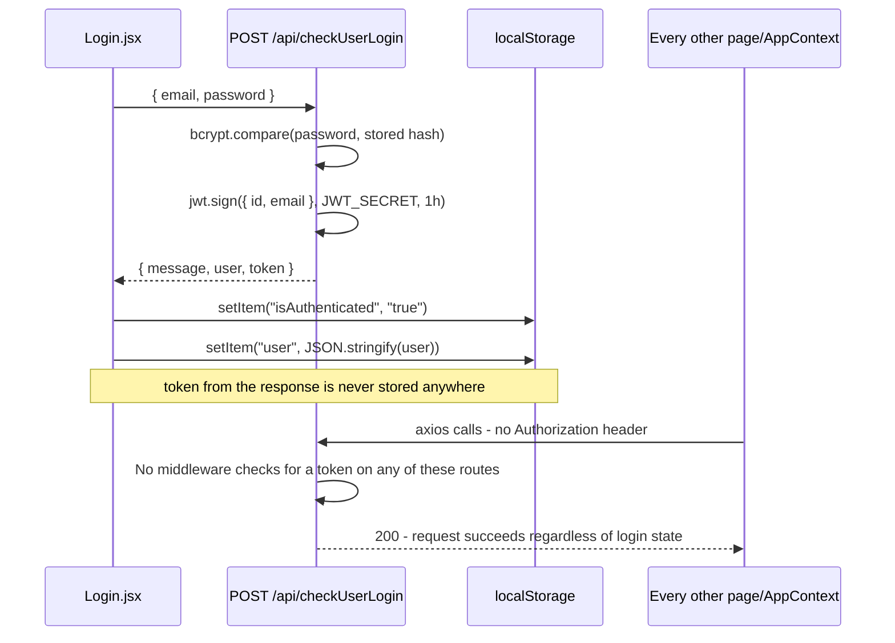

This page traces the entire login flow, end to end, because - unlike most of the other issues documented in this project set - every individual piece here is written correctly. The problem only appears when you follow the token across the boundary between backend and frontend.

## What the backend does correctly

`checkUserLogin` (`backend/components/user.js`) does real, standard password verification: `bcrypt.compare(password, user.password)` against a bcrypt hash stored in the `users` table, and on a match, signs a proper JWT via `jsonwebtoken` with a 1-hour expiry. This is sound - if this token were used the way JWTs normally are (attached to subsequent requests, verified by middleware), it would provide real authentication.

## Where it stops mattering

**The frontend discards the token.** `Login.jsx`'s success handler reads the response but never stores its `token` field - only `localStorage.setItem("isAuthenticated", "true")` and the `user` object are persisted. The token is created, sent over the wire, and then simply not kept.

**`ProtectedRoute.jsx` checks a string, not a credential.** Its entire logic is a single comparison against `localStorage.getItem("isAuthenticated") === "true"`. Anyone can open their browser's dev tools, run `localStorage.setItem("isAuthenticated", "true")`, and reload - no password, no token, no backend round-trip required - to pass this check and reach every page under the protected route tree (`Dashboard`, `Courses`, `Students`, `Teachers`, `Subjects`).

**No frontend request sends a token.** `AppContext.jsx`'s four `useEffect`-triggered fetches, and every create/update/delete call in `Courses.jsx`/`Student.jsx`/`Teacher.jsx`/`Subject.jsx`, are all plain `axios.get(url)`/`axios.post(url, body)` calls with no `headers` option at all - so even if the token *had* been stored, nothing currently reads it back out and attaches it to a request.

**No backend route checks for one either.** There's no auth-middleware file anywhere in `backend/`, and no route file imports `jsonwebtoken`'s `verify` function outside of `user.js`'s own `sign` call. `app.js` mounts `courseRouter`/`studentRouter`/`teacherRouter`/`subjectRouter` with no middleware in front of them - every course/student/teacher/subject route is reachable by a plain, unauthenticated HTTP request from anyone who knows (or guesses) the URL, identical to how it would behave with no login system at all.

## Net effect

The "protection" this app currently has is entirely client-side, entirely cosmetic, and trivially bypassed - it changes what the React app *shows* a person, not what data they can actually reach. A direct request to any `/api/getcourse`, `/api/getstudent`, `/api/createteacher`, etc. endpoint (via curl, Postman, or any other client) succeeds with no credentials of any kind, logged in or not. Fixing this would need, at minimum: the frontend actually storing and re-attaching the JWT (typically as an `Authorization: Bearer <token>` header), and an Express middleware that verifies that header against `JWT_SECRET` and rejects the request otherwise, applied to every router except `userRouter`'s login/register routes.

## `Register.jsx` isn't part of this gap

`Register.jsx` posts to `addUser` and, on success, navigates to `/login` rather than attempting to also log the person in immediately - it doesn't store a token or set `isAuthenticated` itself, so the gap described above is specifically about what happens after a successful *login*, not registration.
