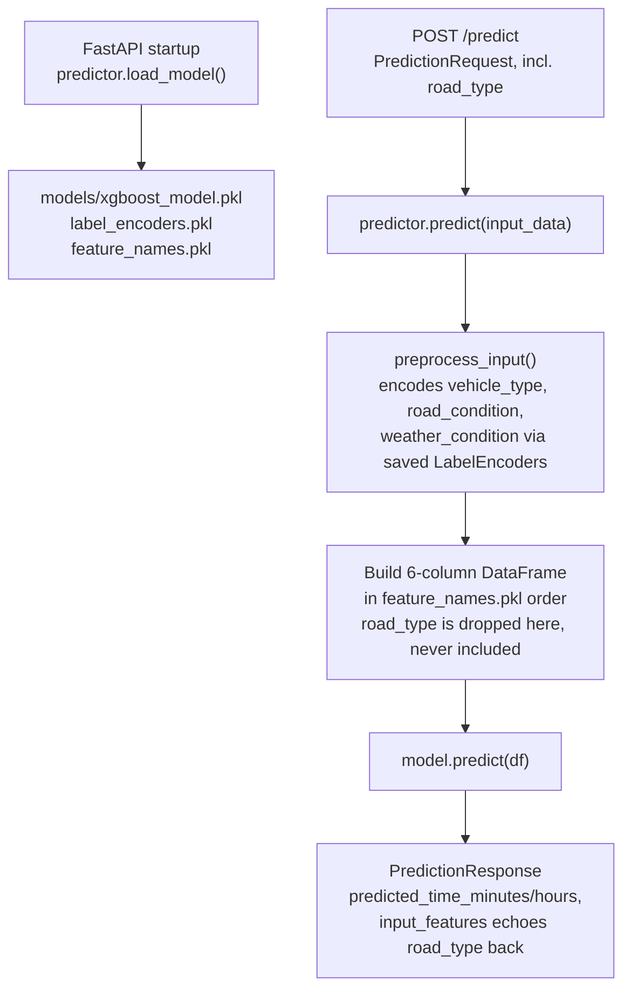

## Loading the model

`predictor` (`app/ml/predict.py`) is a module-level singleton `TravelTimePredictor()` instance, imported once by `app/main.py`. Its `load_model()` is called from a FastAPI `@app.on_event("startup")` hook, reading three pickle files from a `models/` directory relative to wherever the process's working directory is - `models/xgboost_model.pkl` (the fitted `XGBRegressor`), `models/label_encoders.pkl` (a `dict` of fitted `sklearn.LabelEncoder`s, one per categorical feature), and `models/feature_names.pkl` (the exact list and order of columns the model was trained on). If any file is missing, `load_model()` re-raises the exception after printing a hint to run `train.py` first - and since `main.py`'s startup hook only logs the exception rather than stopping the app, a missing/broken model file means the app still starts, but `predictor.model_loaded` stays `False`, so `/health` reports it and `/predict` responds with a `503` instead of ever attempting a prediction.

## Preprocessing: exactly 6 features, in a fixed order

`preprocess_input` takes the raw request dict (which, per the current schema, includes `road_type`), copies it, then:

1. For each of the three categorical features (`vehicle_type`, `road_condition`, `weather_condition`), looks up that feature's fitted `LabelEncoder` and calls `.transform([value])` to get its numeric-encoded form, adding it as `<feature>_encoded`.
2. Builds a plain dict of exactly six keys - `distance_km`, `traffic_hours`, `vehicle_avg_speed`, `vehicle_type_encoded`, `road_condition_encoded`, `weather_condition_encoded` - and wraps it in a single-row `pandas.DataFrame`.
3. Reorders that `DataFrame`'s columns to match `self.feature_names` (loaded from `feature_names.pkl`) before handing it to the model.

`road_type` is present in the input dict this function receives, but it's never read, never encoded, and never added to `feature_dict` - it's silently dropped at this step. See `03-schema-vs-model-mismatch.mdx` for what this means in practice.

## `traffic_hours` is a departure time, not a duration

Despite the name, `traffic_hours` isn't "hours spent in traffic" - `app/models.py`'s column comment and `generate_data.py`'s comment both describe it as **time of day** (`0`-`23.99`, e.g. `8.5` = 8:30 AM), used as a proxy for how congested the route is likely to be at that hour rather than a directly-measured delay. `schemas.py`'s validation (`ge=0, lt=24`) matches this time-of-day interpretation, not a duration - a request wanting to express "8.5 hours of traffic delay" would be misusing the field, since `8.5` there means "starting the trip at 8:30 AM."

## Error handling

`main.py`'s `/predict` handler wraps the whole prediction call in a broad `try/except Exception`, returning a `500` with the exception's string message on any failure - including a `ValueError` from `LabelEncoder.transform` on a category value it's never seen (see `03-schema-vs-model-mismatch.mdx`), which surfaces to the caller as an opaque `500 Internal Server Error` rather than a clearer `400`-level "unsupported value" response, even though the actual cause is a bad-but-schema-valid input rather than a genuine server fault.
