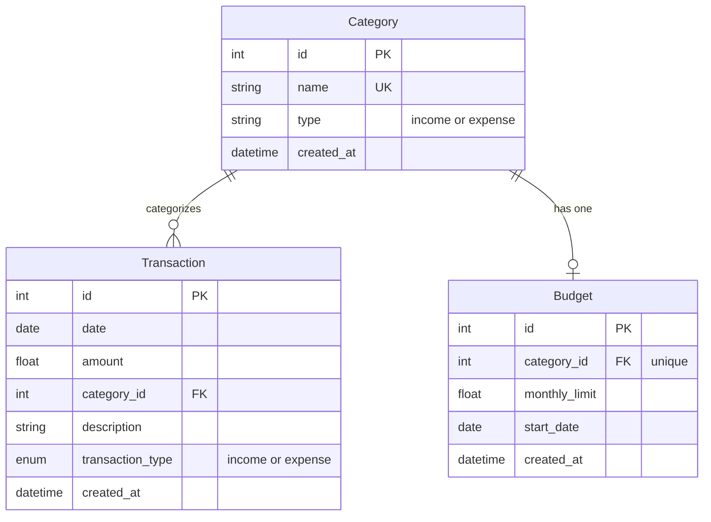

Three tables, no user/auth table anywhere in the schema.

- **`Category`** - `name` is unique; `type` is a plain `String(20)`, not a database enum, holding either `"income"` or `"expense"` by convention (nothing in the schema itself constrains it to only those two values - that validation lives entirely in application code, e.g. the `type` query param filters in `crud.get_categories`).
- **`Transaction`** - `transaction_type` **is** a native Postgres enum (`SQLEnum(TransactionType, name="transaction_type_enum")`), unlike `Category.type`'s plain string - an inconsistency between the two columns that serve a similar income/expense purpose in different tables. A code comment in `models.py` notes the enum needs an explicit `name` for Postgres to create the native type correctly.
- **`Budget`** - `category_id` has a `unique` constraint, so the schema itself enforces "at most one budget per category" (this is also checked at the API layer in `POST /budgets`, which returns a 400 if a budget already exists for that category before the database constraint would ever be hit).

## Connecting to the database (`backend/database.py`)

`DATABASE_URL` is resolved in three steps, in order:

1. Read `DATABASE_URL` directly from the environment (the expected path when using Supabase, which provides one ready-made connection string).
2. If that's not set, fall back to assembling one from individual `DB_USER`/`DB_PASSWORD`/`DB_HOST`/`DB_PORT` (defaulting to `6543`, Supabase's transaction-pooling port)/`DB_NAME` variables.
3. If a resolved URL starts with `postgres://` (the scheme Heroku-style providers historically returned), it's rewritten to `postgresql://` - the scheme SQLAlchemy's Postgres dialect actually expects.

If no `DATABASE_URL` can be resolved at all, the module prints a `CRITICAL ERROR` message to stdout and continues anyway - `create_engine(DATABASE_URL, ...)` is called unconditionally right after, so a genuinely missing configuration would surface as a `create_engine` exception (since `DATABASE_URL` would be `None`) rather than a clean startup failure with the printed message actually preventing that.

The engine is created with `pool_pre_ping=True` (checks each connection is still alive before handing it out, avoiding "server has gone away" errors from a pooled connection that timed out) and `pool_recycle=300` (recycles connections every 5 minutes) - both specifically to cope with Supabase's connection pooler dropping idle connections, per the module's own comments.

`get_db()` is the FastAPI dependency every route uses (`db: Session = Depends(get_db)`) - a generator that yields one `SessionLocal()` instance and always closes it in a `finally` block, the standard SQLAlchemy-with-FastAPI pattern.

## Categories are addressed by name at the API layer, by ID underneath

Every request-facing Pydantic model (`TransactionCreate`, `BudgetCreate`, etc., in `backend/main.py`) takes a `category_name: str`, not a `category_id: int`. Every route handler that receives one looks the category up by name (`crud.get_category_by_name`) and translates it to an `id` before calling into `crud.py`, which operates on `category_id` throughout. `crud.py`'s `create_transaction`/`get_transactions`/etc. also patch a transient `category_name` attribute directly onto the SQLAlchemy `Transaction`/`Budget` instance after loading it (not a mapped column - just a plain Python attribute assignment used to satisfy the response model's `category_name` field), rather than the API layer building that response shape itself in every route.
