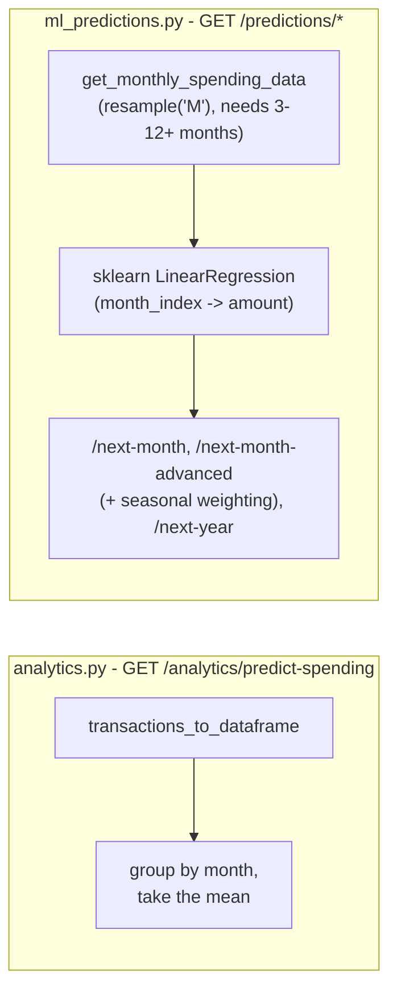

This app has two independently-built systems for estimating future spending, exposed through different endpoint namespaces. Neither is aware of the other.

## `analytics.py`'s predictor: a plain historical average

`predict_monthly_spending` groups every expense transaction by calendar month, takes the **mean** of the monthly totals, and reports a `confidence` string (`"high"`/`"medium"`/`"low"`) based purely on how many months of data exist (≥6 / ≥3 / fewer) - there's no actual statistical trend fitting here, just an average with a coarse confidence label attached. This is what backs `GET /analytics/predict-spending`.

## `ml_predictions.py`'s predictor: real linear regression

`predict_next_month_spending` fits `sklearn.linear_model.LinearRegression` on `(month_index, monthly_total)` pairs from the last 12 months of expense data (requires at least 3 months) and predicts the next month's `month_index`, reporting the model's `r_squared` score as `confidence` and the fitted slope as `monthly_change`/`trend` direction. This is a genuine (if simple - single-feature, no regularization, no cross-validation) trend model, not an average.

`predict_spending_with_seasonality` (`GET /predictions/next-month-advanced`) blends three signals with fixed weights - `0.4 × seasonal_avg + 0.3 × linear_prediction + 0.3 × recent_trend` - where `seasonal_avg` is the average of prior years' totals for *this specific calendar month* (falling back to the general average if there's no prior-year data for that month), `linear_prediction` is the same linear-regression forecast as above, and `recent_trend` is the last 3 months' average. Despite being labeled "seasonality," this isn't a seasonal decomposition model (no STL/Fourier terms, no explicit trend-vs-seasonal separation) - it's a fixed-weight blend of three simple estimators, one of which happens to isolate same-month-last-year data.

`forecast_next_year` (`GET /predictions/next-year`) extends the same linear-regression line 12 months forward from the last known `month_index`, producing one predicted total per future month plus a summed yearly forecast - a straight-line extrapolation, so any actual seasonality in real spending (e.g. a December spike) wouldn't be reflected unless the underlying trend line happens to already be rising into that period.

`predict_budget_exhaustion` doesn't use regression at all - it's a simple rate calculation: current month-to-date spending divided by days elapsed gives a daily rate, which is then projected forward against the remaining budget and remaining days in the month to estimate an exhaustion date (or confirm the budget's already blown).

## Budget alerts

`get_budget_alerts` (`analytics.py`, `GET /analytics/budget-alerts`) checks every budget's current-month spending against its limit and returns one alert per budget that's crossed a threshold - `info` at 80%, `warning` at 90%, `critical` at 100%+ (each with a human-readable message stating dollars remaining or dollars over). Budgets under 80% used produce no alert entry at all rather than a "healthy" status - the endpoint only ever returns budgets that need attention.

## Savings opportunities and unusual spending

- `identify_savings_opportunities` just returns the top 3 expense categories by total spent, each with its average-per-transaction and a generic templated suggestion string ("Consider reviewing `<category>` expenses...") - there's no comparison against a benchmark, budget, or prior period; "opportunity" here just means "this is where most of the money goes."
- `get_unusual_spending` flags any single transaction that's both over 1.5× its category's average transaction size *and* over a flat $50 floor (the dollar floor exists so a category with a tiny average, like a $2 average coffee purchase, doesn't flag every $3 transaction as "unusual").
