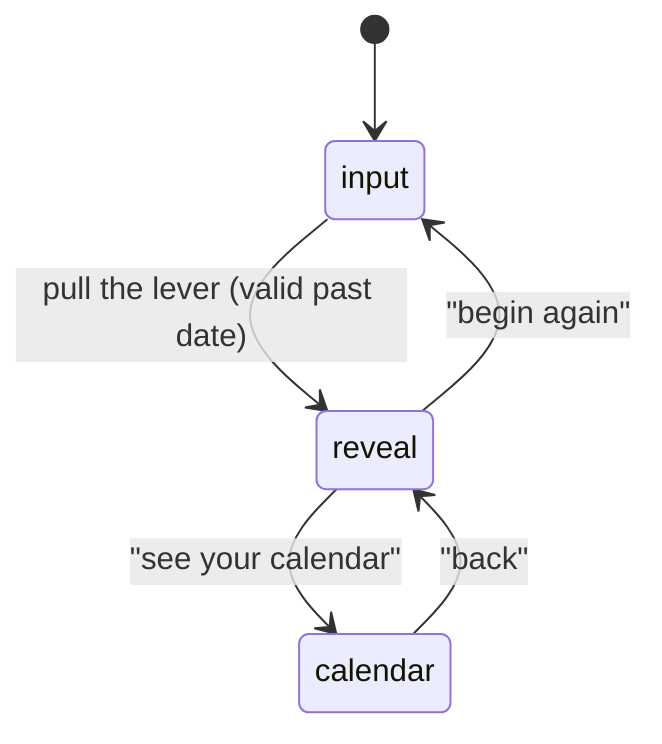

`MementoMori` (`src/MementoMori.jsx`) is the top-level component and owns all of the app's state. It's a three-phase scene switcher driven by a single `phase` string (`"input"` / `"reveal"` / `"calendar"`) - there's no router-level navigation between these; all three are conditionally rendered from the same component tree.

## Phase transitions are all deferred by a timeout

Every transition (`handleReveal`, `reset`, `goCalendar`, `fromCalendar`) follows the same pattern: set `exiting` to `true` (which swaps the current scene's CSS class from `scene-enter` to `scene-exit`, playing a 400ms fade-and-slide-out `@keyframes exit` animation), then after a matching `setTimeout` (400-500ms), actually change `phase` and reset `exiting` back to `false` so the new scene mounts with `scene-enter`. This is a hand-rolled crossfade rather than anything from `framer-motion`.

## Date selection and validation

`monthIdx`, `day`, and `year` are three separate pieces of state (not a single `Date` object), driven by the three `DrumWheel`s (see `03-input-scene-components.mdx`). Two effects keep them consistent:

- If the selected day exceeds the actual number of days in the selected month/year (`daysInMonth`, via `new Date(year, monthIdx + 1, 0).getDate()` - correctly leap-year-aware since it asks the `Date` constructor rather than hardcoding 28/29/30/31), `day` is clamped down to the valid max.
- Changing any of the three fields clears a `dateError` flag, so a previously-shown "select a date in the past" message disappears as soon as the person starts adjusting the wheels again.

`isValidDate` is recomputed every render from `selectedTs < Date.now()` and is checked twice: it disables the `Lever` component directly (visually dimmed, `cursor: not-allowed`, and its click handler is a no-op), and `handleReveal` re-checks it before proceeding (setting `dateError` and bailing out if somehow called anyway).

## The elapsed/remaining calculation

`LIFE_EXPECTANCY_YEARS` is a flat constant, `77`, used identically in both `MementoMori.jsx` and `LifeCalendar.jsx` (declared separately in each file - not imported from one shared place). `getDeathTs(birthTs)` computes a fixed "statistical death" timestamp as `birthTs + 77 * 365.25 * 86400 * 1000` ms (the `.25` accounting for leap years on average, rather than doing real calendar-aware date arithmetic). `getElapsed`/`getRemaining` both return the same shape - `{ seconds, minutes, hours, nights, weeks }` - computed by dividing a single "seconds difference" by the appropriate unit size (`nights` is just seconds ÷ 86400, i.e. days, framed with a more literary label). Both are clamped to a minimum of `0` so the counters never go negative even if the death estimate has already passed or the browser clock is briefly behind the selected birth moment.

## The live tick

`useRaf(callback, active)` is a small custom hook that drives a `requestAnimationFrame` loop only while `active` is true (here, `phase === "reveal"`) - every frame it re-derives `elapsed`/`remaining` for the currently-selected `mode` and calls `setElapsed`/`setRemaining`. Because this runs on every animation frame rather than on a fixed interval, the seconds/minutes/etc. counters update as smoothly as the display refresh rate allows rather than visibly ticking once per second.
