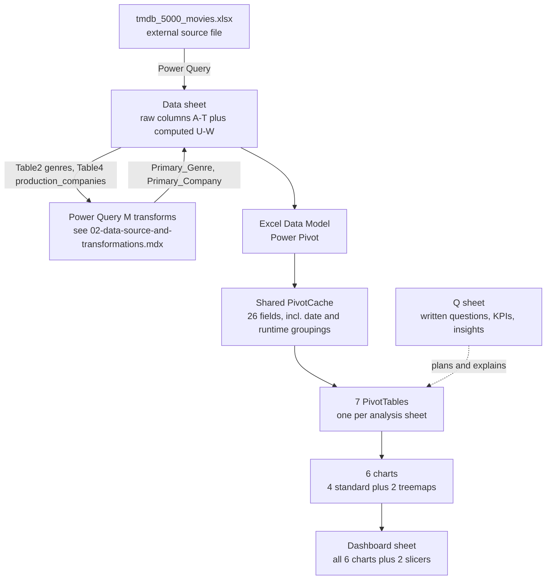

Movie Market Insights is a single Excel workbook - `Dashboard.xlsm` - not a coded application. There's no source repository beyond the file itself and a one-line README (just the project title). It's a self-contained business-intelligence dashboard: raw movie data, cleaned up with Power Query, summarized through seven PivotTables, and visualized as six charts on one consolidated Dashboard sheet.

## How this was documented

`.xlsm` files are ZIP containers (the Office Open XML format) holding the workbook's data as XML - pivot definitions, chart definitions, table definitions, and a Power Query "DataMashup" package - all of it inspectable without opening Excel. Everything on these pages was read directly out of that structure (pivot cache field lists, chart XML, the embedded Power Query M formulas, and VBA module contents extracted from `vbaProject.bin`), not guessed from what a dashboard with these sheet names would probably contain.

## The dataset

Every field name in the workbook's pivot cache - `budget`, `genres`, `homepage`, `id`, `keywords`, `original_language`, `original_title`, `overview`, `popularity`, `production_companies`, `production_countries`, `release_date`, `revenue`, `runtime`, `spoken_languages`, `status`, `tagline`, `title`, `vote_average`, `vote_count` - matches the well-known public **TMDB 5000 Movie Dataset** column-for-column. A Power Query connection is explicitly named `tmdb_5000_movies.xlsx`, confirming the source file. The dataset covers movies with release dates from 1916-09-04 to 2017-02-04 (the exact range Excel's own date-grouping metadata records), with roughly 4,800 rows.

## Workbook architecture at a glance

## Top-level sheet structure

| Sheet (tab order) | Holds | Purpose |
| --- | --- | --- |
| `KPI` | `pvtKPI` (1 pivot) | Three headline numbers: total revenue, average rating, total budget - see `03-pivot-tables-and-sheets.mdx` |
| `BvsR` | `pvtBvsR` (1 pivot) | One row per movie (budget, revenue) - feeds the Budget-vs-Revenue scatter chart |
| `PbyGenre` | `pvtPbyGenre` (1 pivot) | Revenue/budget/profit grouped by `Primary_Genre` |
| `Popularity` | `pvtPopularity` (1 pivot) | Movie count and average rating grouped by release year |
| `MarketDom` | `pvtMarketDom` (1 pivot) | Movie count grouped by `original_language` |
| `Runtime` | `pvtRuntime` (1 pivot) | Average vote count grouped by 20-minute runtime bins |
| `Company` | `pvtCompany` (1 pivot) | Total vote count grouped by `Primary_Company` |
| `Data` | Raw import + computed columns | The actual dataset - see `02-data-source-and-transformations.mdx` |
| `Q` | Plain text, no formulas | The author's own written questions, KPI definitions, and per-chart insight notes - see `03-pivot-tables-and-sheets.mdx` |
| `Dashboard` | All 6 charts + 2 slicers | The single consolidated view - see `04-dashboard-and-charts.mdx` |

No sheets are hidden - all ten are visible tabs in this order.

## Opening and refreshing

Because this workbook depends on an external Power Query source (`tmdb_5000_movies.xlsx`), a Data Model, and macros, opening it will prompt for enabling content/macros, and refreshing the queries (Data > Refresh All) requires that source file to be available at whatever path the query was originally pointed at - without it, the existing cached data (already saved inside the workbook) still displays correctly, but a refresh would fail or prompt to relocate the source file.
