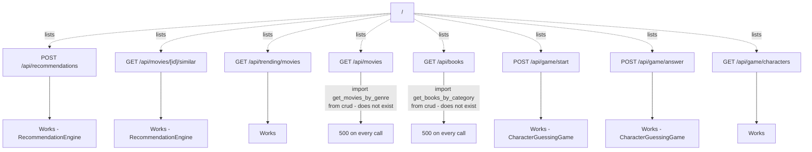

## `app/routes/recommendations.py` (prefix `/api`)

| Route | Status | Notes |
| --- | --- | --- |
| `POST /api/recommendations` | Works | Delegates straight to `RecommendationEngine.recommend_movies` (see `02-recommendation-engine.mdx`); `content_type` in the request body isn't actually branched on anywhere in the route - the engine is movie-only regardless of what's requested |
| `GET /api/movies/{movie_id}/similar` | Works | Delegates to `RecommendationEngine.get_similar_movies` |
| `GET /api/trending/movies` | Works | Delegates to `RecommendationEngine.get_trending_recommendations` |
| `GET /api/movies` | **Broken - 500 on every call** | `from app.database.crud import get_all_movies, get_movies_by_genre` fails unconditionally - `get_movies_by_genre` doesn't exist. See `01-overview.mdx`. |
| `GET /api/books` | **Broken - 500 on every call** | Same failure mode, importing the nonexistent `get_books_by_category`. |

## `app/routes/guessing.py` (prefix `/api/game`)

| Route | Status | Notes |
| --- | --- | --- |
| `POST /api/game/start` | Works | Delegates to `CharacterGuessingGame.start_game` |
| `POST /api/game/answer` | Works | Delegates to `CharacterGuessingGame.answer_question`, requires the caller to round-trip `candidate_ids` and `question_number` (see `03-guessing-game.mdx`) |
| `GET /api/game/characters` | Works | A plain query listing every `Character` row, sorted by `popularity_score` |

## `app/main.py`

| Route | Status | Notes |
| --- | --- | --- |
| `GET /` | Works | Static JSON describing the API and listing endpoints - including the two broken ones above |
| `GET /health` | Works | Queries row counts for `Movie`/`Book`/`Character`; catches any exception and reports `database_connected: false` rather than raising |
| `GET /docs`, `GET /redoc` | Works | FastAPI's automatic interactive documentation - both broken routes would still show up here as documented, callable endpoints, since the `ImportError` only happens when the route function body actually executes, not at app startup or schema-generation time |

## Why this didn't surface at startup or in `/docs`

The broken `import` statements inside `list_movies`/`list_books` are local imports (placed inside the function body, not at module top level), so Python doesn't evaluate them until the function actually runs. This means the app starts cleanly, `/docs` renders both routes as normal-looking, well-documented endpoints, and nothing fails until an actual request hits one of them.
