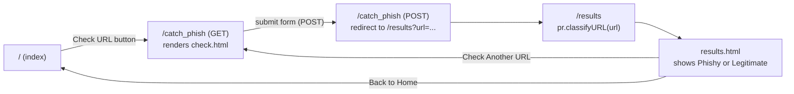

`app.py` is the entire Flask app - three routes, no blueprints, no static-file mount beyond Flask's default.

## Routes

- **`GET /`** - renders `index.html`, a static description of phishing with a link into the checker. No data, no template variables.
- **`GET /catch_phish`** - renders `check.html`, a one-field form (`<input name="url">`).
- **`POST /catch_phish`** - reads `request.form.get('url')`, `print()`s it to the server console (a leftover debug statement, not a logging call), and redirects to `/results?url=<the url>` via `url_for`. The URL isn't validated or sanitized at this point - whatever string was submitted is passed straight through as a query parameter.
- **`GET|POST /results`** (registered for both methods, but only ever reached via the redirect above, so effectively `GET`-only in practice) - reads `url` from the query string, calls `predictor.classifyURL(url)`, and renders `results.html` with both the URL and the verdict.

## Templates

Three self-contained Jinja2 templates (`templates/`), each with its own inline `<style>` block - there's no shared base template/layout, so the header/footer/color scheme (blue accents throughout) is duplicated across all three files rather than defined once.

- **`index.html`** - static content, a bulleted list of phishing red flags, and a link to `/catch_phish`. Its footer has an empty "Created by :" line.
- **`check.html`** - the submission form. It links a stylesheet (`<link rel="stylesheet" href="styles.css">`) that **doesn't exist anywhere in this project** - there's no `static/` folder at all, so this link will 404 silently in the browser; the page still renders correctly since all of its actual styling comes from the inline `<style>` block in the same file, making the missing stylesheet reference harmless in practice but still worth cleaning up.
- **`results.html`** - shows the submitted URL and the classification string. Both are rendered through Jinja2's default autoescaping, so a URL containing HTML-special characters is displayed safely as text rather than being interpreted as markup.

## No input validation

Neither the route handlers nor `predictor.classifyURL` check that the submitted string is actually a well-formed URL before passing it into feature extraction - `urlparse` (used throughout `featuresExt.py`) is permissive and won't raise on most malformed input, so a non-URL string would generally produce a low/zero-valued feature vector and a "Legitimate" verdict rather than a clear error message back to the person using the form.
