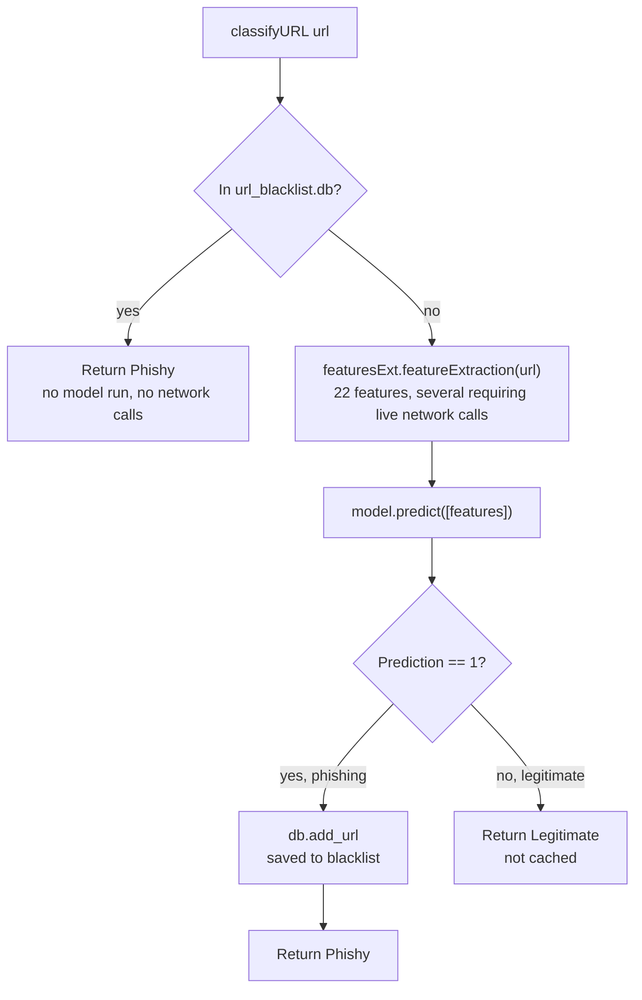

`predictor.py` is the bridge between a submitted URL and a verdict, and it's deliberately structured so a URL only ever gets the (slow, network-dependent) feature extraction treatment once.

## `model.pkl` is loaded once, at import time

`predictor.py` unpickles `model.pkl` at module level (`with open(model_filename, 'rb') as f: model = pickle.load(f)`), not inside `classifyURL` - so the model is loaded exactly once when the Flask process starts (when `app.py` does `import predictor as pr`), not re-read from disk on every request. A consequence of this: if `model.py` is re-run to retrain and overwrite `model.pkl` while the Flask app is already running, the running app keeps using the model it loaded at startup until it's restarted.

## The blacklist check happens first, and only phishing verdicts get cached

`classifyURL` checks `db.search_url(url)` before doing anything else - an exact string match against the `blacklist` table's `url` column (not a normalized/canonicalized comparison, so `http://example.com` and `http://example.com/` would be treated as two different entries). Only if the URL isn't already blacklisted does it proceed to feature extraction and the model. If the model's prediction is `1` (phishing, per `dataset.csv`'s `status` mapping - see `05-model-training.mdx`), the URL is added to the blacklist via `db.add_url` before returning "Phishy." A URL classified "Legitimate" is **never stored anywhere** - there's no legitimate-URL cache, so a legitimate URL gets full feature extraction (including any live network calls) run again every single time it's checked.

## The blacklist database (`database.py`)

One table, `blacklist`: an auto-incrementing `id` and a `url` column (`unique=True`, `nullable=False`). `init_db(app)` is called once in `app.py` at startup, configuring the SQLite URI (`sqlite:///url_blacklist.db`, relative to the app's `instance/` folder per Flask-SQLAlchemy convention) and calling `db.create_all()` inside an app context - this is why `instance/url_blacklist.db` already exists in this checkout rather than needing a separate migration step. `add_url` itself re-checks `search_url` before inserting (a second uniqueness guard on top of the column's own `unique=True` constraint), so a race between two concurrent requests classifying the same brand-new phishing URL could still both pass the `search_url` check before either commits - in Flask's default single-threaded dev server this isn't reachable, but under a multi-worker production WSGI server it could raise an `IntegrityError` from the column constraint on whichever request's `commit()` runs second, which isn't caught here.
