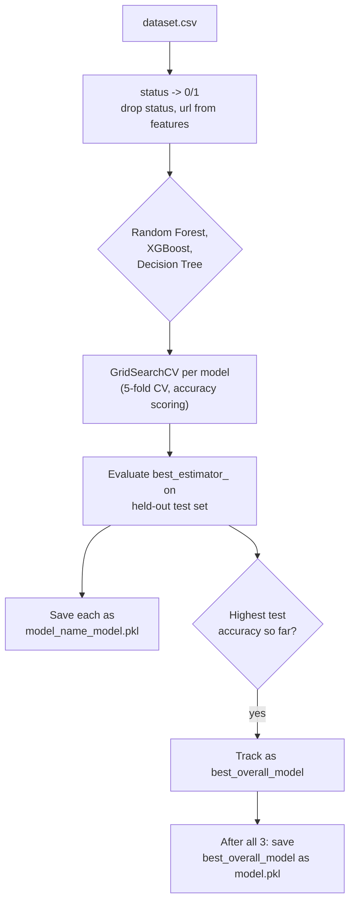

## `model.py` - train, tune, compare, and pick a winner

Run standalone (`python model.py`), not imported by the Flask app at all - it exists purely to produce the `.pkl` files `predictor.py` later loads.

1. **Load and label** - reads `dataset.csv`; if `status` isn't already binary, maps `"legitimate"` to `0` and `"phishing"` to `1` (in this checkout, `status` is already `0`/`1`, so this mapping branch doesn't actually run, but it's there to handle a differently-labeled source CSV).
2. **Feature matrix** - drops `status` and `url`, coercing any remaining object-typed column to `float` or dropping it if that fails (a defensive cleanup step - in the current `dataset.csv` every retained column is already numeric, so nothing gets dropped here today).
3. **Split** - a single 75/25 `train_test_split` (`random_state=0`, so the split is reproducible run-to-run) - no separate validation set; the 5-fold cross-validation inside `GridSearchCV` is what each model's hyperparameters are actually tuned against, with the 25% test split reserved purely for the final accuracy/precision/recall/F1 comparison between the three model types.
4. **Train three model types, each hyperparameter-tuned independently**:
   - **Random Forest** (`class_weight='balanced'`) - grid over `n_estimators` (100/200), `max_depth` (None/10/20), `min_samples_split` (2/5), `min_samples_leaf` (1/2)
   - **XGBoost** (`eval_metric='logloss'`) - grid over `n_estimators` (100/200), `max_depth` (3/5/7), `learning_rate` (0.01/0.1/0.2)
   - **Decision Tree** (`class_weight='balanced'`) - grid over `max_depth` (None/10/20), `min_samples_split` (2/5), `min_samples_leaf` (1/2)

   Random Forest and Decision Tree use `class_weight='balanced'` (automatically reweighting the loss to account for any class imbalance between phishing/legitimate examples); XGBoost's grid doesn't include an equivalent `scale_pos_weight` setting, so it's tuned without that same imbalance correction.
5. **Per-model output** - each model's best estimator (by 5-fold CV accuracy) is evaluated on the test set (accuracy/precision/recall/F1, all with `pos_label=1` i.e. scored against detecting phishing specifically) and saved individually as `<model_name>_model.pkl`, plus a confusion-matrix heatmap PNG in `diagrams/`.
6. **Overall winner** - whichever of the three has the highest **test-set accuracy** (not cross-validation accuracy, and not F1 - plain accuracy is the sole criterion) becomes `best_overall_model`, saved as `model.pkl` once all three have been trained. Because accuracy is the deciding metric, a model that's slightly better at accuracy but worse at recall (catching fewer actual phishing sites) could still be the one that ships as `model.pkl` over a model with better phishing-recall but marginally lower overall accuracy.
7. **Comparison charts** - a train/test split pie chart and one grouped bar chart per metric (accuracy/precision/recall/F1 across all three models), all written to `diagrams/`.

Because which model "wins" depends on this specific run's `train_test_split` and `GridSearchCV` results, **`model.pkl` isn't guaranteed to be XGBoost** even though the README describes the training step as producing "a high-accuracy XGBoost classifier" - see `01-overview.mdx`.

## `visual.py` - a separate exploratory-analysis script

Also reads `dataset.csv` directly (not `processed_dataset.csv` - see `01-overview.mdx`) and produces a separate set of charts in `diagrams/`, independent of `model.py`: scatter plots of `web_traffic`/`domain_age`/`length_url`/`nb_hyphens` against `status`, a 3x3 grid of count plots for categorical-ish features against `status` (its `nb_com` subplot is titled "Number of Comments vs Status" in the code, which is a mislabeling - `nb_com` is actually a count of literal `.com` occurrences in the URL, from `featuresExt.py`'s `check_com`, not a comment count), a full numeric correlation heatmap, distribution histograms, box plots, and a phishing-vs-legitimate pie chart. The script's final few lines (dropping the `url` column into `x`) are set up as if leading into a feature-importance plot, per the preceding comment ("Prepare data for feature importances"), but the script ends immediately after without actually computing or plotting any feature importances - `x`/`y` are built and then never used.
