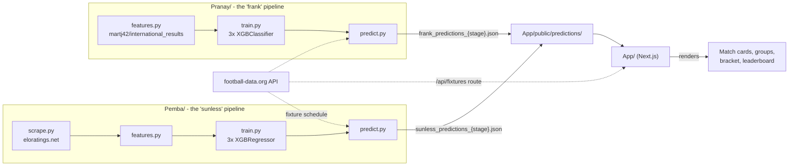

WC2026 Predictor is a monorepo with three independent projects that only communicate through flat JSON files - there's no shared package, no monorepo tooling (no Turborepo/Nx/workspaces), and no runtime API call between the Python and Next.js sides:



## The two competing models

Two different people independently built a full pipeline - scrape/download data, engineer features, train, predict - for the same task (predict `p_win`/`p_draw`/`p_loss` for every WC2026 fixture from team A's perspective), and the frontend displays both side by side as a "model battle." Each pipeline writes its own codenamed prediction files:

| Folder | Codename | Data source | Model type |
| --- | --- | --- | --- |
| `Pemba/` | `sunless` | Scrapes eloratings.net (per-team TSV of match history + pre-computed Elo) | 3× `XGBRegressor`, each regressed onto a 0/1 outcome column |
| `Pranay/` | `frank` | Downloads `martj42/international_results` (~50k-row CSV from GitHub) | 3× `XGBClassifier`, each `predict_proba`'d as a one-vs-rest binary classifier |

Both pipelines predict the same three probabilities for the same fixtures and are compared using the same scoring rule (RPS - see `04-scoring-and-leaderboard.mdx`) once real results come in. The full architectural differences between them are broken down in `05-ml-pipeline-sunless.mdx`, `06-ml-pipeline-frank.mdx`, and compared directly in `07-model-comparison.mdx`.

> ⚠️ Unclear: nothing in either README explains why "sunless"/"frank" were chosen as codenames rather than the folder owners' actual names (`Pemba`, `Pranay`) - the frontend and `config.MODEL_NAME`/`predict.py`'s hardcoded filename are the only places these names are defined.

## Stack

**`App/`** (the only piece an end user interacts with):
- **Next.js 16** App Router, **React 19**, **TypeScript**
- **No CSS framework** - every component is styled with inline `React.CSSProperties`, plus a few `<style>` blocks in `globals.css` for responsive breakpoints
- **`@supabase/supabase-js`** - present and used by `/login` and `/signup`, but not wired into the rest of the app (see `04-scoring-and-leaderboard.mdx`)
- One server-side API route (`/api/fixtures`) that proxies football-data.org; everything else fetches static JSON

**`Pemba/`** and **`Pranay/`** (run manually/offline, not deployed):
- **Python**, **pandas**, **XGBoost**, **SHAP** (per-prediction feature-contribution explanations)
- **`requests`** for scraping/downloading source data
- No web framework, no server - these are one-shot CLI scripts (`run_train.py`, `run_predict.py`) whose only "deployment" step is writing JSON files directly into `App/public/predictions/`

## Running locally

**Frontend:**
```bash
cd App
npm install
npm run dev
```

**Either ML pipeline** (from `Pemba/` or `Pranay/`):
```bash
pip install -r requirements.txt
python run_train.py                    # once, before the tournament
python run_predict.py --stage group    # before each of the 6 stages: group, r32, r16, qf, sf, final
```

`FD_API_KEY` (a football-data.org API key) is read from the environment by both pipelines' fixture-fetching code, and separately hardcoded directly in `App/app/api/fixtures/route.ts`'s `FDORG_KEY` constant rather than read from an environment variable there - see `02-app-routing-and-data-flow.mdx`.

## Top-level structure

| Path | Purpose |
| --- | --- |
| `App/` | The Next.js frontend - see `02-app-routing-and-data-flow.mdx` onward |
| `Pemba/` | The `sunless` ML pipeline - see `05-ml-pipeline-sunless.mdx` |
| `Pranay/` | The `frank` ML pipeline - see `06-ml-pipeline-frank.mdx` |
| `README.md` (root) | Project pitch/description, no setup instructions |
