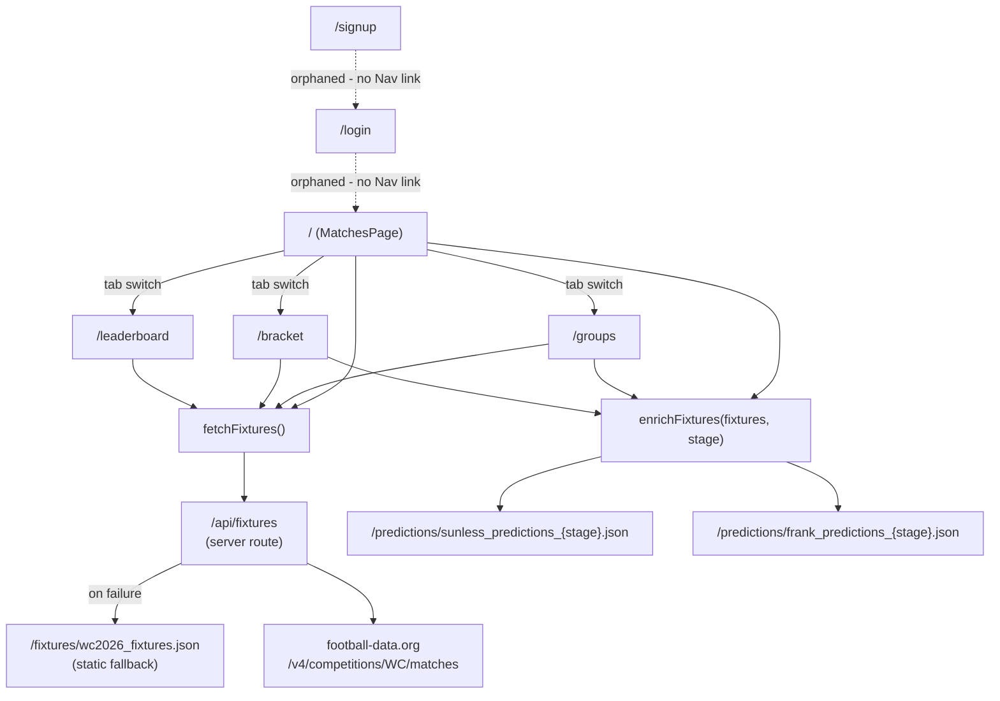

All five pages are `"use client"` components under `App/app/`; there's a single shared `layout.tsx` (loads JetBrains Mono via a Google Fonts `<link>`, renders the decorative `Scales` edge-borders and the `Nav` tab bar around every page) and one API route.

## `/` - MatchesPage (`app/page.tsx`)

Loads all fixtures once via `fetchFixtures()`, then, per active stage tab (Group/R32/R16/QF/SF/Final), calls `enrichFixtures` to attach both models' predictions and renders one `MatchCard` per fixture, sorted by kickoff time. A stats bar shows completed-match count, the next upcoming match's time (in NST), and a "last updated" timestamp; a `setInterval` re-fetches everything every `POLL_MS` (1 hour) so the page stays current without a manual refresh. Switching stage tabs re-runs `enrichFixtures` for just that stage rather than re-fetching fixtures, since `allFixtures` is already cached in state. After a stage loads, the page auto-scrolls (`scrollIntoView`) to the next unplayed match.

## `/groups` - GroupsPage (`app/groups/page.tsx`)

Filters fixtures to `GROUP_STAGE`, enriches them, buckets them by `group` (e.g. `"GROUP_A"`), and renders one `GroupTable` per group. Each `GroupTable` computes its own standings client-side from the matches it's given (see `03-frontend-components.mdx`) - there's no separate standings endpoint or precomputed table anywhere.

## `/bracket` - BracketPage (`app/bracket/page.tsx`)

Filters fixtures to everything *except* `GROUP_STAGE`, groups by stage key, enriches each stage's fixtures in parallel (`Promise.all`), flattens the results, and hands the combined list to `BracketView`, which lays out one column per knockout stage.

## `/leaderboard` - LeaderboardPage (`app/leaderboard/page.tsx`)

The only page that doesn't need `enrichFixtures` - instead it fetches both models' predictions directly for every stage that has at least one `FINISHED` fixture, computes a Ranked Probability Score (RPS) per match per model (`computeRPS`, see `04-scoring-and-leaderboard.mdx`), and renders two summary cards (current cumulative/average RPS per model, sorted best-first) plus a full per-match breakdown table built inline in this file - not via the separate `LeaderboardTable` component, which turns out to be unused (see `04-scoring-and-leaderboard.mdx`).

## `/login` and `/signup`

Both exist and both work against Supabase (`supabase.auth.signInWithPassword` / `supabase.auth.signUp` + an insert into a `users` table), but **neither is linked from `Nav`** or anywhere else in the app, and nothing downstream (the leaderboard, match cards, etc.) reads a logged-in user's session. See `04-scoring-and-leaderboard.mdx` for what this suggests about an unfinished feature.

## Fixture data: `/api/fixtures`

`app/api/fixtures/route.ts` is the only server-side code in `App/`. On `GET`, it calls football-data.org's `/v4/competitions/WC/matches` endpoint (revalidated hourly via Next.js's `fetch` cache), converts each match's UTC kickoff time to NST (Nepal Standard Time, UTC+5:45 - `get_nst_details` adds a fixed `(5*60+45)*60*1000` ms offset) and reshapes it into the app's own `Fixture` type. `lib/data.ts`'s `fetchFixtures()` calls this route first and falls back to the static `public/fixtures/wc2026_fixtures.json` snapshot if the route throws or returns an error - which is also the same file both ML pipelines can read fixtures from if `FD_API_KEY` isn't set for them locally (see `05-ml-pipeline-sunless.mdx`/`06-ml-pipeline-frank.mdx`).

The football-data.org API key (`FDORG_KEY`) is hardcoded directly as a string literal inside `route.ts`, rather than read from an environment variable the way both Python pipelines read their own `FD_API_KEY` - worth knowing since it means the key ships inside the deployed server bundle rather than being rotatable via project settings alone.

## Prediction data: `fetchPredictions` / `enrichFixtures`

`lib/data.ts`'s `fetchPredictions(model, stage)` does a plain `fetch("/predictions/${model}_predictions_${stage}.json")` - a static file under `App/public/predictions/`, written there directly by whichever Python pipeline last ran `run_predict.py` for that stage. `enrichFixtures` fetches both models' predictions for a stage in parallel, indexes each by `match_id`, and merges them onto each `Fixture` as `sunless`/`frank` (`null` if that model has no prediction for that match yet) to produce an `EnrichedMatch`. There's no build step that couples these - a fixture with no matching prediction file just renders "no prediction" on its `MatchCard` (see `03-frontend-components.mdx`).
