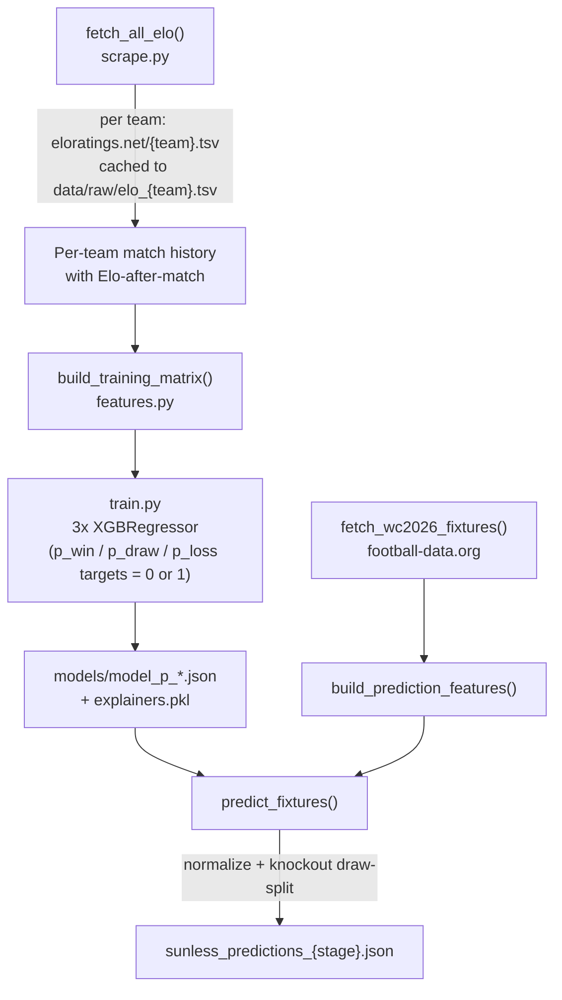

`Pemba/` produces the `sunless`-codenamed predictions. It's a from-scratch scrape-train-predict pipeline built around Elo ratings sourced from a third-party site rather than computed in-house.

## Data source: eloratings.net

`src/scrape.py`'s `fetch_elo_tsv` downloads one tab-separated file per team (`eloratings.net/{Team_Name}.tsv`), each row a historical match with pre-computed Elo values *after* that match. Results are cached to `data/raw/elo_{team}.tsv` and only re-fetched with `--no-cache`. Because the source data already carries Elo, this pipeline never computes ratings itself - it reverse-derives each team's *pre-match* Elo (`elo_team = elo_home_after - elo_change` for the home side, the mirrored formula for away) so that features built "as of" a given date never see a rating that already reflects that match's own result (avoiding lookahead leakage).

`WC2026_TEAMS` (a fixed 48-team list in `config.py`) is the full set of teams scraped - this is a hardcoded roster of the qualified/expected WC2026 field, not derived from the fixtures API.

## Features

`src/features.py`'s `_team_features` computes, for one team as of a given date, using only matches strictly before that date and excluding friendlies (`is_friendly`, detected from the source data's `tournament_code`):

- `elo` - latest known Elo rating
- `ppg_last5`/`ppg_last10` - points-per-game (3/1/0) over the last 5/10 competitive matches
- `goals_scored_last5`/`last10`, `goals_conceded_last5`/`last10`
- `win_rate_vs_top` - win rate specifically against opponents with Elo ≥ `TOP_ELO_THRESHOLD` (1900), over the last 2 years
- `defensive_solidity` - average goals conceded against those same top-Elo opponents

`build_match_features` combines two teams' features plus `h2h_win_rate_a` (head-to-head win rate over their last 5 meetings) and a numeric `stage_encoded` value (`STAGE_ENCODING`, `1`-`6`) into the final 21-column `FEATURE_COLS` row. Any missing value (a team with no scraped history, or too few past matches) stays `None`/`NaN` rather than being imputed - XGBoost natively handles missing values in split decisions, so no imputation step exists.

## Training: three regressors, not classifiers

`src/train.py` trains one `XGBRegressor` per target in `TARGETS = ["p_win", "p_draw", "p_loss"]`, where the training label for each is a hard `0.0`/`1.0` (from `build_training_matrix`'s one-hot `p_win`/`p_draw`/`p_loss` columns derived from the actual match result) - i.e. each model regresses toward "did this outcome happen," not a `predict_proba`-style classifier. `split_data` divides the training matrix by date (`TRAIN_END_DATE` 2023-12-31, `VAL_END_DATE` 2025-12-31, anything after is `test` - empty until real WC2026 results start coming in) rather than a random split, so validation always evaluates on strictly more recent matches than training. A `shap.TreeExplainer` is fit per target and pickled alongside the models for later per-prediction feature attribution.

## Turning three independent regressions into probabilities

Because three independently-trained regressors' raw outputs for one match won't naturally sum to `1.0`, `normalize_preds` clips any negative values to `0` and divides by the row sum (falling back to a `1.0` divisor - i.e. leaving all-zero rows as all-zero - if a row's total is exactly `0`). `predict.py` then applies one more stage-specific adjustment: **for knockout matches** (`is_knockout = stage != "group"`), a draw is impossible, so half of `p_draw` is added to each of `p_win`/`p_loss` and `p_draw` is forced to `0` before the values are rounded to 4 decimal places.

## SHAP values in the output

Each prediction's `shap_values` object comes from the **`p_win` model's explainer only**, applied to that one match's feature row - the output JSON's `shap_values` explain what drove team A's *win* probability specifically, not separate explanations for the draw/loss models.

## Output

`write_predictions` writes the same `sunless_predictions_{stage}.json` file to two places: `Pemba/predictions/` (gitignored, local-only) and `../App/public/predictions/` directly - so running `run_predict.py` from a checkout of this repo immediately updates the file the frontend will serve on its next deploy, with no separate copy/deploy step described in the README needed beyond `git add`/`commit`/`push` from the `App/` side.
