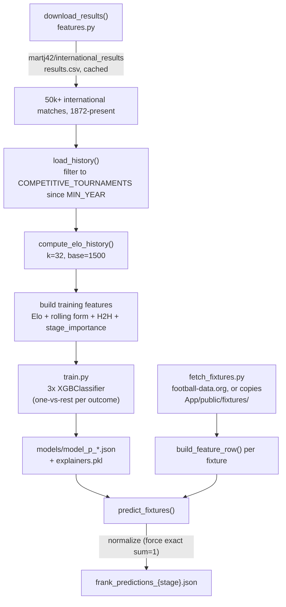

`Pranay/` produces the `frank`-codenamed predictions. Unlike Sunless, it computes its own Elo ratings from raw match results rather than scraping a pre-computed source, and frames the three outcomes as genuine binary classifiers.

## Data source: martj42/international_results

`src/features.py`'s `download_results` fetches a single CSV (~50k rows, 1872-present) from the public `martj42/international_results` GitHub repository, caching it to `data/raw/results.csv`. `load_history` then filters down to `MIN_YEAR` (2000) onward and to `COMPETITIVE_TOURNAMENTS` only - World Cup (and its qualifiers), the continental championships (Euro, Copa América, AFC Asian Cup, AFCON, Gold Cup), and the Confederations Cup - excluding friendlies and lower-profile competitions entirely rather than down-weighting them.

`TEAM_NAME_MAP` (`config.py`) patches over known naming differences between the fixtures source (football-data.org) and this historical dataset - e.g. `"Bosnia-Herzegovina"` → `"Bosnia and Herzegovina"`, `"Czechia"` → `"Czech Republic"` - so a WC2026 fixture's team names resolve to the same history the model was trained on.

## Elo computed in-house

`compute_elo_history` runs the standard Elo update (`k=32`, `base=1500`, logistic expected-score function) match-by-match across the *entire* filtered history in chronological order, building a per-team list of `(date, elo_after_match)` pairs. `elo_at(team, date)` then looks up the most recent rating strictly before a given date - the same no-lookahead guarantee Sunless gets from pre-computed data, but derived here rather than scraped.

## Features

`FEATURE_COLS` (16 columns, `config.py`): `elo_diff`/`elo_a`/`elo_b`, rolling-form stats for each team (`form_win`, `form_draw`, `form_gf`, `form_ga` over the last `FORM_WINDOW` = 10 competitive games, computed by `rolling_form`, which also has a hardcoded cold-start default of a 45% win rate / 22% draw rate / 1.2-1.3 goals for a team with zero prior matches rather than leaving those fields empty), head-to-head win/draw rate and game count (`head_to_head`, last 10 meetings), a `stage_importance` weight (`STAGE_IMPORTANCE_MAP` - World Cup matches weighted `3`, continental tournaments `2`, qualifiers `1`), and a `neutral` flag (`1` for WC2026 fixtures, since a World Cup is played at neutral venues).

This is a narrower, more form-and-momentum-focused feature set than Sunless's (no separate "vs top opponents" or "defensive solidity" splits, but adds tournament-importance weighting that Sunless's `stage_encoded` doesn't distinguish from qualifiers-vs-finals in the same way).

## Training: three genuine binary classifiers

`src/train.py` trains one `XGBClassifier` per outcome (`eval_metric: logloss`) on a temporal 80/20 split - the date-sorted history's first 80% of rows train, the last 20% test, plus `StratifiedKFold` cross-validation for additional metrics - each a proper one-vs-rest binary classifier: the `p_win` model is trained to predict "did team A win" as a 0/1 label, `p_draw` "was it a draw," `p_loss` "did team A lose" - and each is queried via `predict_proba(...)[:, 1]` at inference time to get that outcome's probability, rather than Sunless's approach of regressing a continuous score toward the 0/1 label directly.

## Turning three classifiers into probabilities

`predict_fixtures` takes each classifier's raw `predict_proba` output, sums the three, and divides `p_win`/`p_draw` by that total; `p_loss` is then set to `1.0 - p_win - p_draw` rather than being separately normalized, guaranteeing the three values sum to exactly `1.0` after rounding. **Unlike Sunless, there is no knockout-specific draw redistribution** - `frank`'s `p_draw` can be nonzero even for a knockout-stage fixture where a draw isn't actually a possible final outcome (extra time/penalties would resolve it), since this pipeline doesn't special-case `stage` at prediction time beyond feeding it into the `stage_importance` feature.

## SHAP values in the output

Same pattern as Sunless: `shap_values` in the output JSON come only from the `p_win` classifier's `TreeExplainer`, applied to that match's feature row - not separate explanations per outcome.

## Fixture handling and output

`fetch_fixtures.py` is a small standalone script (not present in the Sunless pipeline) that either pulls fresh fixtures from football-data.org (if `FD_API_KEY` is set) and writes them to *both* `Pranay/data/fixtures/` and `App/public/fixtures/` in NST-converted form, or - if no key is set - just copies the existing `App/public/fixtures/wc2026_fixtures.json` into this project's own `data/fixtures/` folder so `run_predict.py` has something to read locally. `write_predictions` writes `frank_predictions_{stage}.json` to both `Pranay/predictions/` and directly into `../App/public/predictions/`, identical in spirit to Sunless's output step. Each prediction object also includes an explicit `"model": "frank"` field (`config.MODEL_NAME`) - Sunless's output objects don't carry an equivalent `"model": "sunless"` key, since `Pemba/src/predict.py` never adds one.
