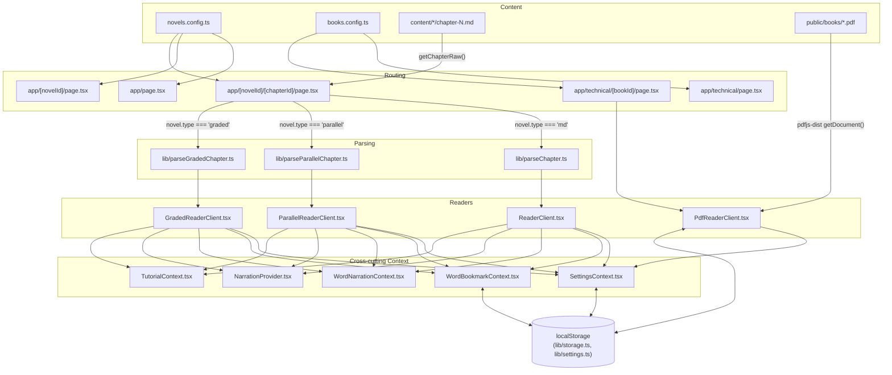

## End-to-end data flow

There is no server at runtime — `next.config.js` sets `output: 'export'`, so every page you see below is either a statically pre-rendered file (novel/chapter pages, technical-book pages) or a client component hydrating on top of one. All "backend" logic is either a build-time filesystem read (`lib/getChapters.ts`, run inside Server Components) or a browser-side `localStorage` read/write (`lib/storage.ts`, `lib/settings.ts`).

Two independent content systems share the same shell (`app/layout.tsx`, `SettingsContext`, `SettingsPanel`) but otherwise don't touch each other:

1. **Novels** — `novels.config.ts` → `app/[novelId]/[chapterId]/page.tsx` picks a parser (`lib/parseChapter.ts` / `lib/parseParallelChapter.ts` / `lib/parseGradedChapter.ts`) and a reader client (`ReaderClient` / `ParallelReaderClient` / `GradedReaderClient`) based on the novel's `type` field. See [Novel Readers](/docs/schatten-lesen/novel-readers).
2. **Technical books (PDFs)** — `books.config.ts` → `app/technical/[bookId]/page.tsx` → `PdfReaderClient`, which renders PDFs client-side via `pdfjs-dist`. See [Technical Books (PDF Reader)](/docs/schatten-lesen/pdf-technical-reader).

Within a chapter page, four independent Context providers wrap the reader UI, each re-created per chapter (via a `resetKey={chapterNum}` prop) so state like "bookmark select mode armed" doesn't leak across navigation:

```ts
<WordBookmarkProvider resetKey={chapterNum}>
  <WordNarrationProvider resetKey={chapterNum}>
    <NarrationProvider segments={narrationSegments} lang={...}>
      <TutorialProvider novelType={...}>
        {/* header, ChapterBookmarkLayer > actual chapter renderer, footer, TutorialSheet */}
      </TutorialProvider>
    </NarrationProvider>
  </WordNarrationProvider>
</WordBookmarkProvider>
```

`SettingsContext` sits one level higher, mounted once globally in `app/layout.tsx` (not per-chapter), since font size/theme/etc. should persist across navigation rather than reset.

## Module diagram



## Key architectural decisions

- **Custom annotation dialect instead of MDX/remark.** Chapters are plain text files using a hand-rolled `{word|type|translation|example}` inline syntax (see [Novel Readers](/docs/schatten-lesen/novel-readers)), parsed by three purpose-built line parsers rather than a general Markdown pipeline. This keeps the parsers small and exactly tailored to the three content shapes the app needs (annotated prose, DE/EN paragraph pairs, story+vocab+quiz), at the cost of not supporting arbitrary Markdown.
- **Static export, no backend.** `output: 'export'` means every route is pre-rendered at build time (`generateStaticParams()` on every dynamic route) and the whole app ships as static files. This is what lets the same build be deployed to Vercel *and* wrapped by Capacitor as a native Android app — there's no server to run inside the native shell.
- **`localStorage` as the only persistence layer, feature-by-feature.** There's no shared "app state" store — reading progress, the word bookmark, PDF page/scroll position, and reader settings are four independent `localStorage`-backed systems (`lib/storage.ts` for the first three, `lib/settings.ts` for the fourth), each with its own key prefix and its own get/set functions. Nothing is normalized into one blob.
- **One Context per feature, not one combined "reader state" Context.** Bookmarking, word-narration-on-tap, full-chapter narration playback, and the tutorial overlay are four separate Context providers (`WordBookmarkContext`, `WordNarrationContext`, `NarrationProvider`, `TutorialContext`) composed together in each reader client, rather than a single combined provider. This keeps each concern's logic isolated, at the cost of the visible nesting pyramid in every reader client (see the snippet above).
- **Three separate reader client components, not one parameterized reader.** `ReaderClient`, `ParallelReaderClient`, and `GradedReaderClient` are distinct components with near-identical header/footer chrome (hand-duplicated across all three, including the `motion.div` hover-scale wrapper and its `transformOrigin` fix) rather than one component branching internally on content type. This trades some duplication for each reader being simpler to read in isolation and free to diverge (e.g. only `GradedReaderClient` renders `VocabList`/`QuizSection`; only `ParallelReaderClient` has a language-mode setting).

> ⚠️ Unclear: there's no automated test suite in the archive (no `*.test.ts`/`*.spec.ts` files, no test runner in `package.json`), so architectural claims above about behavior (e.g. Context re-render scoping) are based on reading the code and standard React semantics, not on observed test coverage.
