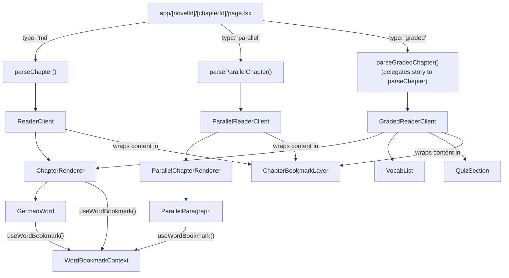

## What it does

**User perspective:** Every novel is read in one of three modes, chosen per-novel (not by the reader):

- **Annotated** (`type: 'md'`) — English prose with individual German words colour-coded by grammatical type and tappable for a translation popup. A Reveal mode (toggled in Settings) shows the translation inline instead, tap to flip back.
- **Parallel** (`type: 'parallel'`) — German and English paragraph pairs, shown as German-only, English-only, or (in "Both" mode) one language at a time with a tap-to-flip "warp" transition between them.
- **Graded** (`type: 'graded'`) — a short plain German story followed by a tap-to-reveal vocabulary list and a multiple-choice quiz.

**Technical perspective:** `app/[novelId]/[chapterId]/page.tsx` reads the novel's `type` from `novels.config.ts`, parses the chapter's raw text file with the matching parser, and renders the matching top-level reader client. All three parsers work on the same underlying content dialect for prose (headings, paragraphs, tables, dividers), differing in how they handle inline annotation.

## Where it lives

- `lib/parseChapter.ts` — base parser: splits a chapter into `ParsedLine[]` (headings/paragraphs/tables/dividers) and tokenizes paragraph/heading text into `Token[]`, recognizing the inline annotation syntax `{word|type|translation|example}` (the `example` segment is optional) via `ANNOTATION_RE`.
- `lib/parseParallelChapter.ts` — recognizes `DE:`/`EN:` prefixed paragraph pairs and produces `ParsedParallelLine[]` of headings and `ParagraphPair` paragraphs.
- `lib/parseGradedChapter.ts` — delegates the story portion to `parseChapter.ts`, then separately parses vocabulary and quiz sections into `ParsedGradedChapter { storyLines, vocabulary, quiz }`.
- `components/ReaderClient.tsx`, `components/ParallelReaderClient.tsx`, `components/GradedReaderClient.tsx` — the three top-level reader shells: header (back link, tutorial/narration/bookmark toggles, settings), main content, prev/next footer. Each composes the same four Context providers (`WordBookmarkProvider`, `WordNarrationProvider`, `NarrationProvider`, `TutorialProvider`) around its content, with a `resetKey={chapterNum}` on the bookmark/narration providers so armed states reset on navigation.
- `components/ChapterRenderer.tsx` — renders `ParsedLine[]` for both the Annotated and Graded readers (shared, since both use the same base prose format); assigns each word a stable sequential `wordIndex`; colours the definite/indefinite article at the start of a table cell by grammatical gender (`GenderedCell`/`ARTICLE_MAP`).
- `components/GermanWord.tsx` — one annotated word: hover/tap popup (word, type, translation, example) or, in Reveal mode, an inline tap-to-flip translation.
- `components/ParallelChapterRenderer.tsx` / `components/ParallelParagraph.tsx` — render `ParsedParallelLine[]`; `ParallelParagraph` handles the three `languageMode` cases (`en`/`de` fixed, or `both` with an animated flip) and assigns each paragraph a sequential index for bookmarking.
- `components/VocabList.tsx` / `components/QuizSection.tsx` — graded-chapter-only: a tap-to-reveal term/meaning chip list, and a locking multiple-choice quiz with per-question right/wrong feedback.

## How it connects

- Connects to: all three readers pass their extracted narration segments (see [Narration (Text-to-Speech)](/docs/schatten-lesen/narration)) into `NarrationProvider`, and wrap their rendered content in `ChapterBookmarkLayer` (see [Word Bookmarking](/docs/schatten-lesen/word-bookmarking)) for click-to-bookmark/click-to-narrate delegation.
- Connected from: only `app/[novelId]/[chapterId]/page.tsx` renders these three components; none of them are used from the technical-books (PDF) subsystem.

## Key functions/components

- **`ANNOTATION_RE`** (`lib/parseChapter.ts`) — `/\{([^|{}]+)\|([^|{}]+)\|([^|{}]+)(?:\|([^}]+))?\}/g`, matching `word`, `type` (a `WordType`: `verb`/`conj`/`adv`/`adj`/`masc`/`fem`/`neut`/`pron`), `translation`, and an optional `example`, each trimmed. Text outside the braces becomes plain `{ kind: 'text' }` tokens.
- **`ChapterRenderer`'s word-index precomputation** — every word (annotated or plain) needs a stable sequential index so a bookmarked word can be found again later. This is computed once via `useMemo` as a per-line starting offset (`lineStartIndices`), not via a mutable counter threaded through the render. A code comment in the file explains why: an earlier version used a single shared mutable counter object incremented as JSX was built, which broke as soon as a bookmark was set — `GermanWord`/`Tokens` read the bookmark via `WordBookmarkContext`, so React re-renders just those consumers directly without re-invoking their parent `ChapterRenderer`, and the old shared counter kept incrementing from wherever the last *full* render had left it, silently shifting every word's index.
- **`GenderedCell`/`ARTICLE_MAP`** (`ChapterRenderer.tsx`) — colours the leading `der`/`die`/`das`/`den`/`dem`/`des`/`ein`/`eine`/`kein`/etc. article in a table cell by grammatical gender (blue for masculine, pink for feminine, green for neuter, a blue→green gradient for the genuinely ambiguous dative/genitive forms like `dem`/`des`, and a dotted underline for `der` on its own, which is ambiguous between nominative-feminine and genitive/dative-plural). Only applied inside tables (`GenderedCell`), not in running prose.
- **`GermanWord`** — in the default (Annotate) mode, shows the German word colour-coded by `WordType`, with a hover (desktop) or tap (touch, detected via `window.matchMedia('(pointer: coarse)')`) popup positioned via `getBoundingClientRect()` to stay within the viewport, flipping above the word if there isn't `160px` of room below. In Reveal mode, the word itself is the toggle: tap to flip between the German word and its translation inline, no popup.
- **`ParallelParagraph`**'s warp transition — in `languageMode === 'both'`, tapping a paragraph triggers `motion`'s `AnimatePresence` with hand-tuned keyframe arrays (`ENTER_WARP`/`EXIT_WARP`: skew, scale-x/y, blur, opacity all animated in short multi-step sequences) to give the language-flip a brief "warping" visual effect rather than a plain crossfade.
- **`QuizSection`** — `selectAnswer` only ever accepts a question's *first* answer (`if (prev[questionNumber]) return prev`), so once a question is answered it locks; the option buttons then colour green (correct) / red (the option that was picked, if wrong) / dim (everything else).

## Gotchas

- **`showAnnotationToggle` gates both the Settings panel's Word Display option *and* the tutorial's Annotation tab**, and is computed in `app/[novelId]/[chapterId]/page.tsx` as `novel.annotated !== false && !novel.genre.includes('IELTS')` — i.e. annotation is opt-*out* (defaults on unless `annotated: false` is set) but is unconditionally suppressed for any novel tagged `IELTS` in its `genre` array, regardless of its own `annotated` field.
- **`ChapterRenderer` is shared between the Annotated and Graded readers, but `ParallelChapterRenderer` is entirely separate** — there's no shared base renderer across all three modes; the two prose-based readers share one component while the paragraph-pair reader has its own parallel implementation with its own paragraph-index-assignment logic.
- **Bookmark granularity differs by reader type**: Annotated/Graded chapters bookmark individual words (`wordIndex` = word's position in the chapter's token stream), while Parallel chapters bookmark whole paragraphs (`wordIndex` = paragraph's position) — both are stored under the same `WordBookmark.wordIndex` field in `lib/storage.ts`, so the field means something different depending on which novel type it points at.
- **`TutorialSheet`'s `novelType` prop must match the `NovelType` string union** (`'md' | 'graded' | 'parallel'`) used both to pick tutorial tab content (`lib/tutorialContent.ts`) and to key the "seen" flag in `localStorage` — each reader client hardcodes the correct literal when rendering `TutorialProvider`/`TutorialSheet`, so adding a fourth novel type would require updating `lib/tutorialContent.ts`'s `NovelType` union and every call site that currently assumes exactly three.
