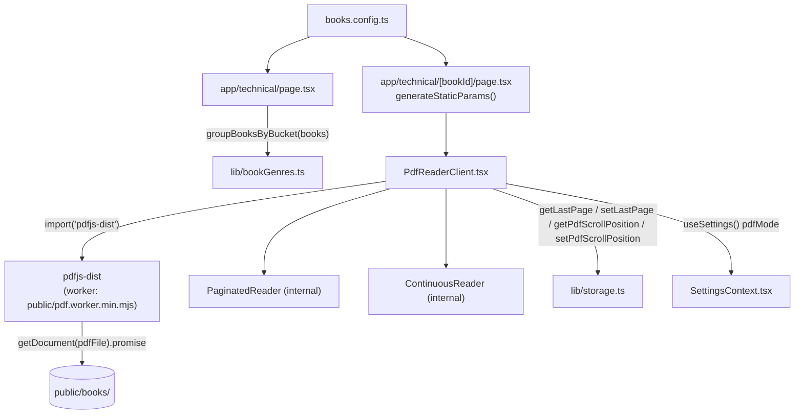

## What it does

**User perspective:** A separate section (`/technical`, subtitled "German study material, trading, Python, data analysis, and machine learning references") — a personal library of trading, Python, data-analysis, and machine-learning reference PDFs, plus a handful of German study PDFs (a personal reading book and A1/A2 glossaries/grammar references), grouped into buckets (Deutsch, Trading, Python, Data Analysis, Machine Learning, Others). Opening a book renders it as a proper in-browser PDF reader with two modes: page-by-page (with zoom, page-number entry, prev/next) or a continuous scrollable feed. Reading position is remembered per book.

**Technical perspective:** `books.config.ts` is a flat static catalog of `{id, title, author, description, genre, pdfFile}` entries pointing at PDFs in `public/books/`. `app/technical/[bookId]/page.tsx` renders `PdfReaderClient`, which loads and renders the PDF entirely client-side via `pdfjs-dist`, drawing pages to `<canvas>`.

## Where it lives

- `books.config.ts` (project root) — the book catalog and `getBook(id)` lookup.
- `lib/bookGenres.ts` — buckets books into a fixed category order for the `/technical` index page.
- `app/technical/page.tsx` — the technical-books index page (client component; unlike the novel pages, this one is `'use client'` rather than a Server Component, since it needs `SettingsPanel`'s narration/pdf-mode UI to work but doesn't fetch anything dynamic). Each list row shows `book.author || book.description` as the subtitle, so books with no `author` (the German study PDFs, whose `author` field is `''`) fall back to showing their `description` instead of a blank line.
- `app/technical/[bookId]/page.tsx` — per-book route; `generateStaticParams()` pre-renders one page per book, `dynamicParams = false` means any `bookId` not in `books.config.ts` 404s at request time rather than attempting an on-demand render.
- `components/PdfReaderClient.tsx` — the actual PDF viewer: header/footer chrome, `PaginatedReader` and `ContinuousReader` sub-components.
- `public/books/*.pdf` — the PDF files themselves, served as static assets.
- `public/pdf.worker.min.mjs` — the `pdfjs-dist` worker script, copied here at `npm install` time by `scripts/copy-pdf-worker.js` (see `docs/overview.md`).

## How it connects

- Connects to: `SettingsContext` (for the `pdfMode` setting, toggled via `SettingsPanel`'s `showPdfMode` prop passed from `app/technical/page.tsx`), `lib/storage.ts` (page/scroll persistence functions distinct from the novel-reading progress functions).
- Connected from: `app/technical/[bookId]/page.tsx` only. This subsystem shares no components with the three novel readers beyond `SettingsPanel`/`SettingsContext`.

## Key functions/components

- **`lib/bookGenres.ts` `getBookBucket(book)`** — checks the book's `genre` array against `BUCKET_TAGS` **in priority order** (`Deutsch` → `Trading` → `Machine Learning` → `Data Analysis` → `Python`) and returns the first bucket whose tag list intersects; falls back to `'Others'` if nothing matches. Because this is priority-ordered rather than showing a book in every matching bucket, a book tagged both `['Python', 'Machine Learning']` (e.g. `hands-on-machine-learning`) lands only in **Machine Learning**, not also in Python.
- **`groupBooksByBucket(books)`** — maps `BOOK_BUCKETS` (the fixed display order, `['Deutsch', 'Trading', 'Python', 'Data Analysis', 'Machine Learning', 'Others']`) to `{bucket, books}` groups and filters out empty buckets, so the index page never shows a heading with no books under it.

  > ⚠️ Gotcha: `BOOK_BUCKETS` (display order) and `BUCKET_TAGS` (priority-check order) list `Python`, `Data Analysis`, and `Machine Learning` in different relative orders. This has no visible effect today because no current book's `genre` array collides across exactly those three buckets in a way that would expose the mismatch, but it means the on-screen bucket order isn't a reliable guide to which bucket a multi-tag book will actually land in — check `BUCKET_TAGS`, not `BOOK_BUCKETS`, for that.
- **`PdfReaderClient({ bookId, bookTitle, pdfFile })`** — on mount, dynamically imports `pdfjs-dist`, sets `GlobalWorkerOptions.workerSrc = '/pdf.worker.min.mjs'` (an absolute path — this only resolves correctly because `next.config.js` sets `output: 'export'`, which serves `public/` at the site root), and calls `getDocument({ url: pdfFile }).promise` to load the document, storing the result in `docRef` (a plain ref, not state, since re-renders don't need to react to the doc object itself) and `numPages` in state. Arrow-key `ArrowLeft`/`ArrowRight` are bound globally to `navRef.current?.goPrev()`/`goNext()` — `navRef` is populated by whichever of the two sub-readers is currently mounted, letting the shared header/footer control either reader without knowing which one is active.
- **`PaginatedReader`** — renders one `<canvas>`, re-rendering it (`renderPage`) whenever `pageNum` or `scale` changes. `renderPage` computes a `fitScale` so the page width fits the container (capped at `MAX_PAGE_WIDTH = 900`px) times the user's zoom `scale`, accounts for `devicePixelRatio` for crisp rendering on high-DPI screens, and **cancels any in-flight render task** (`renderTaskRef.current.cancel()`) before starting a new one — necessary because rapid page/zoom changes would otherwise race. `useEffect` also persists `setLastPage(bookId, pageNum)` and resets scroll to top on every page change.
- **`ContinuousReader`** — the more complex of the two: renders one fixed-size placeholder `
` per page up front (`computeLayout` pre-fetches every page's viewport dimensions to reserve correct scroll height without rendering canvases yet), then uses an `IntersectionObserver` (`rootMargin: '800px 0px'`) to lazily render each page's canvas only once it scrolls near the viewport (`renderSlot`), and **evicts far-away rendered canvases** once more than `MAX_RENDERED = 24` pages have been rendered (`evictIfNeeded`, keeping only pages within `6` of the current page) to bound memory use on very long PDFs. Scroll position is throttled via `requestAnimationFrame` and persisted (debounced 400ms) as `{page, ratio}` — the fractional scroll position *within* the current page, not just the page number — so returning to a book resumes at the exact scroll offset, not just the top of a page. `GAP = 0` — pages stack with no gap between them, so the offset math (`offsetsRef`) is just a running sum of page heights with no extra spacing to account for.
- **`PdfReaderClient`'s footer** — a page-number `<input>` (free text, parsed on blur or Enter via `submitPageInput`) that calls `navRef.current?.jump(parsed)` if the parsed number is a valid in-range integer, otherwise reverts the input to the current page number.
- **`PdfReaderClient`'s header title link** — wrapped in a `min-w-0 flex-1` container with `style={{ transformOrigin: 'left center' }}` so the `whileHover={{ scale: 1.05 }}` spring grows the link from its left edge rather than its center; without this, scaling from center would push a long, already-truncated title further past the container's right edge on hover. A `title={bookTitle}` attribute also surfaces the full title as a native tooltip when the visible text is truncated.

## Gotchas

- **`docRef` is a plain `useRef`, not `useState`** — assigning to it inside the `load()` effect does not itself trigger a re-render; `PdfReaderClient` relies on the sibling `numPages`/`loading` state updates (which *do* happen in the same effect, right after `docRef.current = doc`) to trigger the re-render that then reads the now-populated `docRef.current` when passing `doc={docRef.current}` to the sub-readers. This ordering is fragile — inserting an early return between the two assignments would silently break rendering.
- **Two entirely separate `localStorage`-backed position systems exist per book**: `getLastPage`/`setLastPage` (used by `PaginatedReader`, just a page number) and `getPdfScrollPosition`/`setPdfScrollPosition` (used by `ContinuousReader`, a `{page, ratio}` pair). Switching `pdfMode` between Paginated and Continuous does **not** carry position across — going from Continuous (say, scrolled halfway through page 40) to Paginated jumps to whatever page number `getLastPage` last recorded for Paginated mode specifically, which may be stale or `1` if Paginated was never used for that book.
- **`ContinuousReader`'s eviction (`evictIfNeeded`) zeroes a canvas's `width`/`height` to free memory** rather than removing the DOM node — the placeholder `
` (sized from `dimsRef`) stays in place so scroll position/layout doesn't jump, but the evicted canvas will need to be observed back into view and re-rendered by the `IntersectionObserver` if scrolled back to.
- **`GlobalWorkerOptions.workerSrc` is a hardcoded absolute path (`/pdf.worker.min.mjs`)** — this depends entirely on `scripts/copy-pdf-worker.js` having successfully run at `npm install` time (via the `postinstall` script in `package.json`) and on the static export serving `public/` at the site root; if the worker file is ever missing from `public/`, the PDF load will fail with the generic `'Could not load this PDF.'` error message, with no more specific diagnostic surfaced to the reader.
