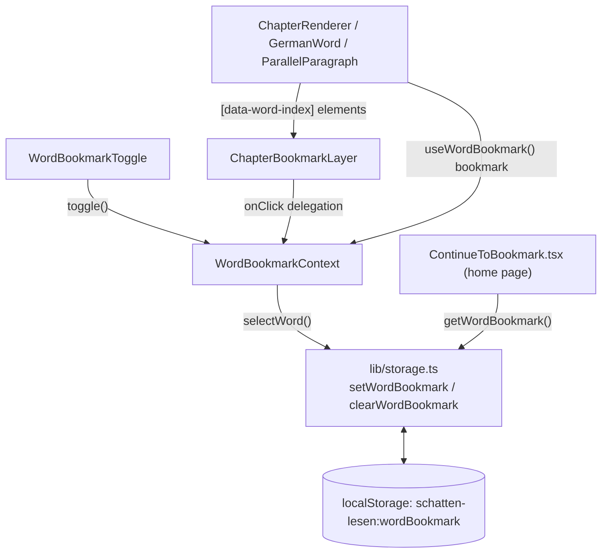

## What it does

**User perspective:** Tap the pencil icon in any reader's header to arm "pick a word" mode, then tap any word (or, in a Parallel novel, any paragraph) to save it as *the* bookmark — there is only ever one, app-wide. The home page then shows a "Your Bookmark" card linking straight back to that exact word, scrolled into view and highlighted. Tapping the already-bookmarked word again clears it instead of re-saving it.

**Technical perspective:** A single `WordBookmark` object in `localStorage`, set via a click-delegation layer that listens for taps on any `[data-word-index]` element while bookmark-select-mode is armed, independent of which reader type (Annotated/Parallel/Graded) is currently rendering.

## Where it lives

- `lib/storage.ts` — the `WordBookmark` type (`{ novelId, novelTitle, chapter, wordIndex, wordText, savedAt }`) and `getWordBookmark`/`setWordBookmark`/`clearWordBookmark`.
- `components/WordBookmarkContext.tsx` — `WordBookmarkProvider`/`useWordBookmark`: holds `active` (select-mode armed) and `bookmark` (the current bookmark, mirrored from `localStorage` into React state on mount) in state, exposes `toggle`/`deactivate`/`selectWord`.
- `components/ChapterBookmarkLayer.tsx` — wraps a reader's rendered content; a single `onClick` handler on the wrapping `
` finds the closest `[data-word-index]` ancestor of whatever was clicked and, if select-mode is active, calls `selectWord`. Also scrolls the bookmarked element into view on mount if the URL hash is `#bookmark`.
- `components/WordBookmarkToggle.tsx` — the header pencil/bookmark button; shows a pencil (touch devices, while armed) or a filled/outline bookmark icon depending on whether the *current* chapter contains the bookmark.
- `components/ContinueToBookmark.tsx` — the home-page "Your Bookmark" card; reads `getWordBookmark()` directly (not via `WordBookmarkContext`, since it renders outside any reader) on mount and on every `pathname` change.
- `components/ChapterRenderer.tsx` / `components/GermanWord.tsx` / `components/ParallelParagraph.tsx` — the actual `[data-word-index]`/`[data-word-text]` elements that become bookmarkable (see [Novel Readers](/docs/schatten-lesen/novel-readers)).
- `app/globals.css` — `.word-select-mode` (cursor styling while armed) and `.word-bookmarked` (the amber highlight) utility classes.

## How it connects

- Connects to: every reader client wraps its content in one `ChapterBookmarkLayer` and one `WordBookmarkProvider`; the renderers underneath (`ChapterRenderer`/`GermanWord` for Annotated/Graded, `ParallelParagraph` for Parallel) both render the `data-word-index` markers *and* read `bookmark` back out of the same context to know whether to apply the `.word-bookmarked` class to themselves.
- Connected from: `ContinueToBookmark` on the home page is the only consumer outside a reader page, and it bypasses the Context entirely (reading `localStorage` directly) since it isn't rendered inside a `WordBookmarkProvider`.

## Key functions/components

- **`WordBookmarkContext`'s `selectWord(params)`** — compares the tapped word against the *current* bookmark by `novelId`+`chapter`+`wordIndex`; if it's the same word, calls `clearWordBookmark()` and sets state to `null` (toggle-off), otherwise overwrites with the new word (`{...params, savedAt: Date.now()}`) — there is no "list of bookmarks", only ever one.
- **`ChapterBookmarkLayer`'s `handleClick`** — a single delegated click handler rather than a click handler on every word; it bails immediately unless either bookmark-select-mode *or* word-narration-arm-mode is active (see [Narration (Text-to-Speech)](/docs/schatten-lesen/narration) — the same delegation layer serves both features), then walks up from `e.target` via `.closest('[data-word-index]')` to find the tapped word regardless of which inner element was actually clicked.
- **`WordBookmarkToggle`'s icon logic** — shows `IconPencil` (not the bookmark icon) specifically when `active && isTouch`, since touch devices have no hover cursor to change into a pencil the way desktop does; otherwise shows `IconBookmarkFilled` if `hasBookmarkHere` (the bookmark belongs to *this* `novelId`+`chapter`) or `IconBookmark` (outline) otherwise — so the icon can't distinguish "no bookmark at all" from "bookmark exists elsewhere", both render as the outline icon.
- **The `#bookmark` URL hash + `scrollIntoView`** — `ContinueToBookmark`'s link is `/${novelId}/${chapter}#bookmark`; `ChapterBookmarkLayer` checks `window.location.hash === '#bookmark'` on mount and, if the bookmark belongs to the chapter currently being viewed, finds the matching `[data-word-index]` element and calls `scrollIntoView({ block: 'center', behavior: 'smooth' })`. The highlight itself isn't driven by this scroll effect — it's applied by each renderer via the `isBookmarked` check against context state, independent of scrolling.

## Gotchas

- **There is exactly one bookmark for the entire app, not one per novel.** Bookmarking a word in a second novel silently replaces whatever was bookmarked in the first — there's no list or history, and no warning shown when overwriting an existing bookmark.
- **The amber highlight (`.word-bookmarked`) is applied per-renderer via React state, not imperatively.** A code comment in `ChapterBookmarkLayer.tsx` notes this used to be added via `classList` and never removed from the *previous* bookmarked element (highlights piled up) and didn't survive elements unmounting/remounting (e.g. a Parallel paragraph flipping DE/EN) — the fix was to have each renderer derive `isBookmarked` from context on every render instead.
- **Reading progress ("last chapter read") and the word bookmark are entirely separate systems** that can point at different novels simultaneously — see the "Gotchas" section of [Library Home & Reading Progress](/docs/schatten-lesen/library-and-progress) for how that plays out on the home page.
