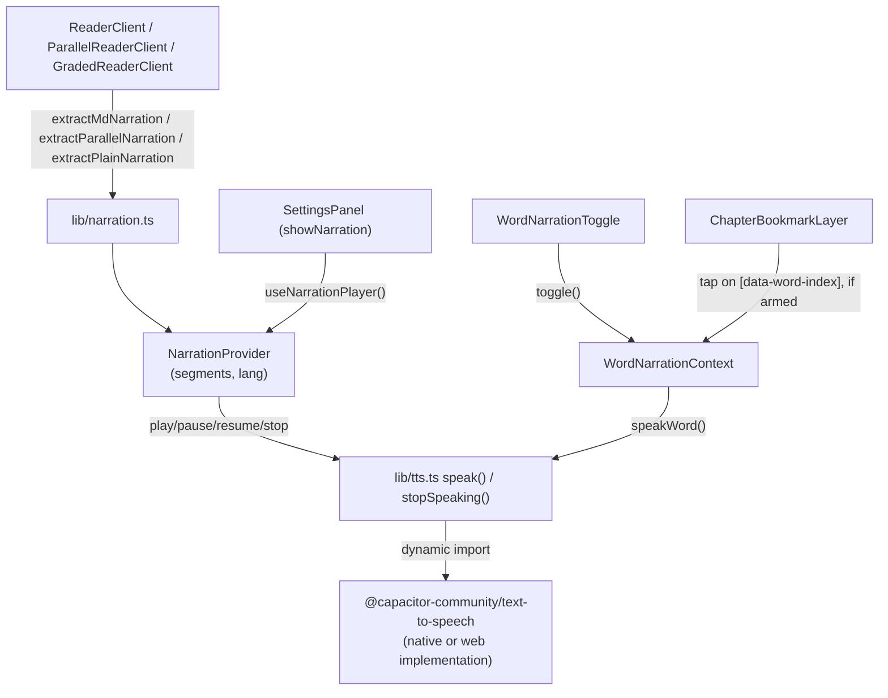

## What it does

**User perspective:** Two independent ways to hear a chapter read aloud:

1. **Tap-a-word narration** — tap the speaker icon in the header to arm it, then tap any word or paragraph to hear just that one spoken.
2. **Full-chapter narration** — the Listen controls in Settings (Play/Pause/Stop), which read every paragraph/heading in sequence, one language at a time.

**Technical perspective:** Both narration modes ultimately call `lib/tts.ts`'s `speak()`, a thin wrapper around the `@capacitor-community/text-to-speech` plugin (which has its own web implementation, so it works both inside the native Android shell and in a regular browser). Full-chapter narration additionally needs per-reader-type text extraction (`lib/narration.ts`) to turn parsed chapter content into a flat list of narratable strings.

## Where it lives

- `lib/tts.ts` — `isTtsSupported()`, `speak(text, lang)`, `stopSpeaking()`.
- `lib/narration.ts` — `extractMdNarration`, `extractPlainNarration`, `extractParallelNarration`: convert a reader type's parsed lines into `string[]` segments.
- `components/NarrationProvider.tsx` — full-chapter sequential playback state machine (`play`/`pause`/`resume`/`stop`), exposed via `useNarrationPlayer()`.
- `components/WordNarrationContext.tsx` — tap-a-word arm/disarm state, exposed via `useWordNarration()`.
- `components/WordNarrationToggle.tsx` — the header speaker-icon button that arms word narration; also triggers `VoiceCaveatToast` the first time.
- `components/VoiceCaveatToast.tsx` — a dismissible one-time toast warning that the device may lack a German voice.
- `components/ChapterBookmarkLayer.tsx` — the same click-delegation layer used for bookmarking also handles tap-a-word narration (see [Word Bookmarking](/docs/schatten-lesen/word-bookmarking)) — when word-narration is armed, a tap calls `speakWord` instead of `selectWord`.
- `components/SettingsPanel.tsx` — renders the Play/Pause/Stop controls when `showNarration` is passed and `narration.available` is true.

## How it connects

- Connects to: each reader client computes its own `narrationSegments` with the extraction function matching its content type, and passes them (plus a fixed `lang`) into `NarrationProvider`. `ReaderClient` always narrates in `en-GB`; `GradedReaderClient` always narrates in `de-DE`; `ParallelReaderClient` picks `de-DE`/`en-GB` based on the current `languageMode` setting.
- Connected from: `SettingsPanel`'s Listen section is the only UI for full-chapter playback; `WordNarrationToggle` + `ChapterBookmarkLayer` are the only path for tap-a-word narration.

## Key functions/components

- **`lib/narration.ts`'s three extraction functions** differ in what text they pull, matching how each reader mode presents German vs English: `extractMdNarration` (Annotated) substitutes each annotated word's **translation**, not the German word itself, since the surrounding prose is English; `extractPlainNarration` (Graded) does the opposite — the story is already German, so annotated words keep their original German `word`; `extractParallelNarration` picks `line.data.german` or `line.data.english` based on `languageMode`, and returns `null` (making the whole feature unavailable) when `languageMode === 'both'`, since there's no single fixed language to read in flip mode.
- **`NarrationProvider`'s `runFrom(startIndex)`** — an async loop over `segments`, calling `await speak(segments[i], lang)` one at a time; checks a `stopRef` before each segment (immediate exit) and polls a `pauseRef` in a `150ms` `setTimeout` loop before each segment (so pausing doesn't cancel the loop, just blocks it between segments).
- **`isTtsSupported()`** (`lib/tts.ts`) — checks `Capacitor.isNativePlatform()` first (native TTS always assumed supported inside the app shell), falling back to checking `'speechSynthesis' in window` for the web case; the result is cached in a module-level variable after the first call.
- **`WordNarrationContext`'s `speakWord`** — a thin wrapper that dynamically imports `lib/tts.ts` and calls `speak(text, lang)` directly, with no queueing or state tracking (unlike `NarrationProvider`) — tapping a second word while the first is still being spoken just starts a second overlapping `speak()` call.

## Gotchas

- **Pause/resume operates at segment granularity, not mid-utterance.** `pause()` calls `stopSpeaking()`, which cancels whatever the TTS plugin is currently saying immediately — it does not let the in-flight segment finish. Because `runFrom`'s loop is `await`ing that same `speak()` call, cancelling it lets the loop advance to `i++` before the pause-poll is reached, so **`resume()` continues with the *next* segment, not a replay of the one that was interrupted.**
- **`speak()` swallows all errors silently** (`catch { return }`) — if the TTS plugin fails to load or throws (e.g. no voice available for the requested language), there is no error surfaced to the UI; narration just silently does nothing for that segment/word.
- **Tap-a-word narration and bookmark-select mode share one click-delegation layer (`ChapterBookmarkLayer`) but are mutually exclusive** — `handleClick` checks `narrateActive` before `active` (bookmark mode), so if both were somehow armed at once, narration would win; in practice each reader's header only lets one be armed at a time via its own toggle button, but the two Contexts don't explicitly prevent both being set programmatically.
