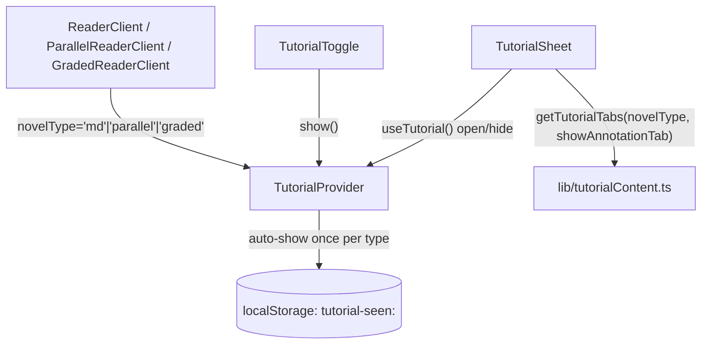

## What it does

**User perspective:** The first time a reader opens a chapter of a given novel *type* (Annotated, Parallel, or Graded — not per novel), a bottom sheet automatically pops up explaining that reader's features in tabs (Bookmarks, Narration, and a type-specific tab). It can be reopened any time via the `?` icon in the header.

**Technical perspective:** A tiny Context (`TutorialContext`) tracks whether the sheet is open, auto-opening it once per `novelType` by checking/setting a `localStorage` flag on mount. Tab content is static, keyed by novel type, in `lib/tutorialContent.ts`.

## Where it lives

- `components/TutorialContext.tsx` — `TutorialProvider`/`useTutorial`: `open` state, `show`/`hide`, and the auto-show-once-per-type effect.
- `components/TutorialSheet.tsx` — the actual bottom-sheet UI: a tab bar plus a scrollable list of bullet lines for the active tab, portaled to `document.body`.
- `components/TutorialToggle.tsx` — the header `?` button that calls `show()`.
- `lib/tutorialContent.ts` — `NovelType`, `TutorialTab`, `DEVICE_VOICE_CAVEAT`, and `getTutorialTabs(novelType, showAnnotationTab)`, which returns a fixed tab list per type.

## How it connects

- Connects to: each reader client renders exactly one `TutorialProvider`/`TutorialSheet` pair, passing its own hardcoded `novelType` literal; `ReaderClient` additionally passes `showAnnotationTab={showAnnotationToggle}` through to `TutorialSheet` (the only reader where the tab set can vary).
- Connected from: `TutorialToggle` (the `?` button) is the only other consumer of `useTutorial()`.

## Key functions/components

- **`TutorialProvider`'s auto-show effect** — on mount, builds the key `tutorial-seen:${novelType}`, and if `localStorage` doesn't already have it, sets it to `'1'` and opens the sheet. This runs once per mount, keyed only by `novelType` — since a fresh `TutorialProvider` is mounted on every chapter navigation (it lives inside the reader client, not above it), the check re-runs on every chapter, but the `localStorage` flag from the *first* chapter viewed of that novel type prevents it from reopening on subsequent ones.
- **`getTutorialTabs(novelType, showAnnotationTab)`** — always includes a Bookmarks tab and a Narration tab, then appends one type-specific tab: an Annotation tab for `'md'` (only if `showAnnotationTab` is true), a Vocab & Quiz tab for `'graded'`, or a Language tab for `'parallel'`. `showAnnotationTab` has no effect for `'graded'`/`'parallel'` novels, which is why `ParallelReaderClient`/`GradedReaderClient` don't bother passing it when rendering `TutorialSheet`.
- **`TutorialSheet`'s `mounted` guard** — like other portaled UI in this codebase (`GermanWord`'s popup, `SettingsPanel`), it waits for a post-mount `useEffect` before calling `createPortal`, to avoid a server/client markup mismatch under Next.js's static export.

## Gotchas

- **The tutorial's "seen" flag is not namespaced under the app's `schatten-lesen:` `localStorage` prefix** that every other persisted value in the app uses (`lib/storage.ts`'s `PREFIX`, `lib/settings.ts`'s own key) — it's a bare `tutorial-seen:${novelType}` key, written directly via `window.localStorage.setItem` inside `TutorialContext.tsx` rather than through a shared storage helper. Functionally harmless (keys don't collide), but it means a future "clear all app data" feature built against the `schatten-lesen:` prefix would miss these three flags.
- **"Seen" is tracked per novel *type*, not per novel** — a reader who's already dismissed the tutorial on one Annotated novel will never see it again on a *different* Annotated novel, even if that novel's specific vocabulary/features differ.
