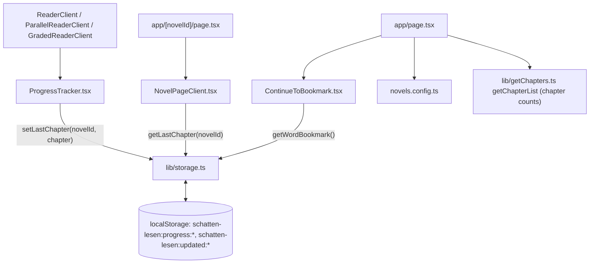

## What it does

**User perspective:** The home page lists every novel as a cover-art card in a responsive grid, plus a card linking to the separate "Read Educational Books" (PDF) section. If the reader has an active word bookmark, a "Your Bookmark" card appears above the grid, one tap from picking up exactly where they left off. Opening a novel's detail page shows a "Continue Ch. N" / "From start" button pair once the reader has progressed past chapter 1.

**Technical perspective:** Reading progress (last chapter read per novel) and the single word bookmark are both plain `localStorage` values with no server sync, surfaced on the home page and novel detail page by small client components that read storage directly (bookmark) or via `lib/storage.ts` helpers (progress).

## Where it lives

- `app/page.tsx` — the home page: server component, maps `novels.config.ts` to cards, embeds `ContinueToBookmark`, `HomeHeader`, `GlareCard` (the "Read Educational Books" tile).
- `app/[novelId]/page.tsx` — novel detail page: cover, metadata, genre chips, description, chapter list, embeds `NovelPageClient`.
- `components/NovelPageClient.tsx` — "Continue Ch. N" / "From start" / "Start reading" button logic.
- `components/ContinueToBookmark.tsx` — home-page bookmark card (see [Word Bookmarking](/docs/schatten-lesen/word-bookmarking) for the bookmark mechanism itself).
- `components/ProgressTracker.tsx` — invisible component mounted inside every reader page that records "you're currently on chapter N" as a side effect.
- `lib/storage.ts` — `getLastChapter` / `setLastChapter` / `getLastUpdated`, and `PROGRESS_EXCLUDED_IDS`.
- `components/GlareCard.tsx` — the animated starfield card used as the "Read Educational Books" tile on the home page.
- `components/HomeHeader.tsx`, `components/NovelHeader.tsx` — sticky header chrome for the home and novel-detail pages respectively (both just wrap `SettingsPanel.tsx` plus a themed link).

## How it connects

- Connects to: `app/page.tsx` reads `novels.config.ts` directly and calls `getChapterList` (from `lib/getChapters.ts`) per novel just to compute `chapterCount` (which is fetched but **not actually rendered anywhere** on the card — see Gotchas). `NovelPageClient` and `ContinueToBookmark` both re-read their respective storage on every `pathname` change via `usePathname()`, so returning to these pages after reading always reflects the latest state.
- Connected from: `ProgressTracker` is the only writer of reading-progress state; it's mounted once per reader client component (`ReaderClient`, `ParallelReaderClient`, `GradedReaderClient` — not `PdfReaderClient`, which tracks its own page/scroll position instead, see [Technical Books (PDF Reader)](/docs/schatten-lesen/pdf-technical-reader)).

## Key functions/components

- **`ProgressTracker({ novelId, chapter })`** — renders nothing; a single `useEffect` calls `setLastChapter(novelId, chapter)` whenever `novelId`/`chapter` changes, i.e. on every chapter page load/navigation.
- **`lib/storage.ts` `setLastChapter(novelId, chapter)`** — writes both `schatten-lesen:progress:<novelId>` (the chapter number) and `schatten-lesen:updated:<novelId>` (a `Date.now()` timestamp), **unless** `novelId` is in `PROGRESS_EXCLUDED_IDS = ['ugly-duckling', 'a1-glossary']` — these two are demo/reference content, not meant to show "in progress" state. `getLastUpdated` exists to read that timestamp back but isn't currently called from anywhere in the components read for this doc.

  > ⚠️ Unclear: `getLastUpdated` has no call site found anywhere in `app/` or `components/` — it may be dead code, or intended for a "recently read" sorting feature on the home page that hasn't been built yet.

- **`NovelPageClient({ novelId, chapters })`** — reads `getLastChapter(novelId)` (defaults to `1` if nothing stored) into local state on mount/`pathname` change. Renders **"Start reading"** (single full-width button to chapter 1) if `lastChapter` is `null` or `1`; renders **"Continue Ch. N"** + a smaller **"From start"** button pair if `lastChapter > 1`. Returns `null` entirely if the novel has zero chapters (defensive guard against an empty `content/` folder).
- **`app/page.tsx` `HomePage()`** — a Server Component; maps every novel to `{ novel, chapterCount: getChapterList(novel.contentFolder).length }`. Renders a card per novel with a blurred, scaled background copy of the cover image behind a normal contained copy (a common "fill + focus" cover-art technique), plus a small badge (`Demo`/`IELTS`/`A1`/`A2`/`B1`/`B2`) picked as the *first* matching tag found in the novel's `genre` array against that fixed priority list. The grid's final tile is a static `Link` to `/technical` styled via `GlareCard`.
- **`GlareCard`** — no longer a pointer-tracking tilt/glare wrapper. It now renders a dark gradient card overlaid with a fixed field of 90 randomly-positioned dots (`generateStars()`, seeded once via `useState`), each independently animated by `motion` through an idle opacity pulse (`[opacity, opacity * 0.25, opacity]`, random duration/delay per star so they don't pulse in sync) to look like a twinkling starfield; `useReducedMotion()` freezes stars at a static opacity for reduced-motion users. Each star is a memoized `StarDot` so re-renders of the parent don't restart other stars' animation loops. Still just a generic presentational wrapper — not specific to the "Read Educational Books" tile — but currently only used there.

## Gotchas

- **`chapterCount` is computed on every home-page load (one `getChapterList` filesystem call per novel) but is never rendered** — `app/page.tsx` builds `novelData` with `chapterCount` and then only destructures `{ novel }` when mapping to JSX, discarding `chapterCount` entirely. This is either leftover from a removed UI element or a card badge waiting to be added; either way it's wasted work at build time (since this is a Server Component and the underlying data is static, it happens once at build/export, not per-request, so the performance cost is at most a slightly slower `next build`, but it's still dead code as written).
- **"Last read" and "bookmark" are two entirely separate persistence mechanisms** that can point to different chapters/novels at the same time — a reader could have progressed to chapter 20 of one novel (tracked by `ProgressTracker`/`getLastChapter`) while their one app-wide bookmark sits on a completely different novel/word. The home page surfaces the bookmark prominently ("Your Bookmark") but "last chapter read" is only visible per-novel, on that novel's own detail page — there's no home-page-level "continue reading" list across all in-progress novels.
- **`PROGRESS_EXCLUDED_IDS` is a hardcoded array of novel IDs**, not a config flag on the `Novel` type itself in `novels.config.ts` — adding a new demo/reference novel that shouldn't track progress requires remembering to also edit this separate list in `lib/storage.ts`.
