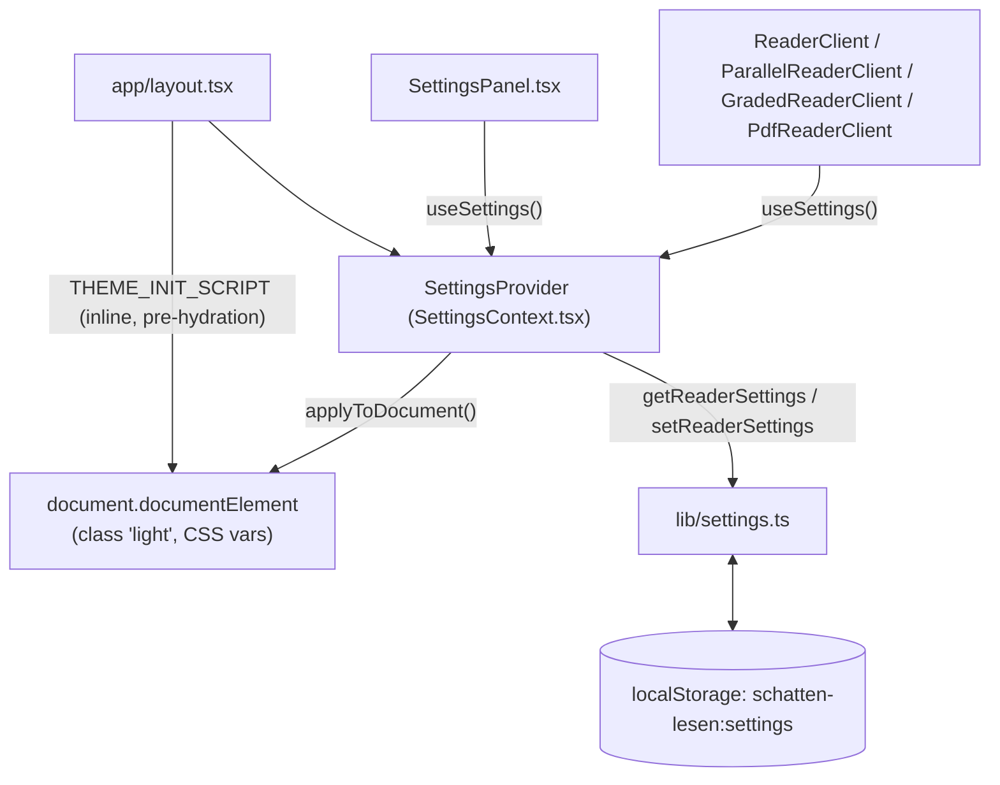

## What it does

**User perspective:** The gear icon in every header opens a settings panel covering theme (Light/Dark/Auto), font size, font style (Mono/Sans/Serif), screen brightness (a dimming overlay for night reading), Word Display (Annotate vs Reveal, annotated novels only), Language (DE/EN/Both, parallel novels only), PDF reading mode (technical books only), and, contextually, chapter narration Play/Pause/Stop. Everything is saved automatically to the browser; there's no account.

**Technical perspective:** One `ReaderSettings` object, sanitized on every read/write, persisted as a single JSON blob in `localStorage`, exposed app-wide via `SettingsContext` (mounted once, globally, in `app/layout.tsx`), plus a theme/font "flash of unstyled content" avoidance script injected directly into `<head>`.

## Where it lives

- `lib/settings.ts` — the `ReaderSettings` type, defaults, min/max constants, `sanitize()`, and the raw `localStorage` get/set functions.
- `components/SettingsContext.tsx` — React Context wrapping `lib/settings.ts`; applies theme/font-size/font-family to `document.documentElement` as a side effect.
- `components/SettingsPanel.tsx` — the actual popover UI, conditionally showing sub-sections based on props from the calling reader.
- `app/layout.tsx` — mounts `SettingsProvider` globally and injects `THEME_INIT_SCRIPT`, an inline `<script>` that reads `localStorage` synchronously before React hydrates, to avoid a flash of the wrong theme/font on load.
- `app/globals.css` — defines the CSS custom properties (`--n100`...`--n900`, `--reading-font-size`, `--reading-font-family`) that both the inline script and `SettingsContext` write into.

## How it connects

- Connects to: every reader client component (`ReaderClient`, `ParallelReaderClient`, `GradedReaderClient`, `PdfReaderClient`) reads settings via `useSettings()` for font size/family (and, for `PdfReaderClient`, `pdfMode`). `SettingsPanel` is rendered from `HomeHeader.tsx`, `NovelHeader.tsx`, `app/technical/page.tsx`, and each reader's header.
- Connected from: only `lib/settings.ts` touches `localStorage` directly for this feature.

## Key functions/components

- **`ReaderSettings`** (`lib/settings.ts`): `{ theme, fontSize, fontFamily, brightness, annotationMode, languageMode, pdfMode }`. `DEFAULT_SETTINGS` sets `theme: 'dark'`, `fontSize: 15`, `fontFamily: 'mono'`, `brightness: 100`, `annotationMode: 'annotate'`, `languageMode: 'both'`, `pdfMode: 'paginated'`.
- **`sanitize(raw)`** — defends every field independently against corrupt/partial/legacy `localStorage` data: unrecognized `theme`/`fontFamily`/`annotationMode`/`languageMode`/`pdfMode` values fall back to their defaults, and `fontSize`/`brightness` are clamped to `[FONT_SIZE_MIN, FONT_SIZE_MAX]` = `[12, 24]` and `[BRIGHTNESS_MIN, BRIGHTNESS_MAX]` = `[50, 100]` respectively (or replaced with the default if not a valid number at all). This runs on every `getReaderSettings()` and `setReaderSettings()` call, so settings can never end up outside these bounds regardless of what's stored.
- **`getReaderSettings()`** — returns `DEFAULT_SETTINGS` unchanged if `window` is undefined (SSR/build time) or if the stored value is missing or fails `JSON.parse`; otherwise merges `{...DEFAULT_SETTINGS, ...JSON.parse(raw)}` through `sanitize()`.
- **`setReaderSettings(patch)`** — merges `patch` onto the *current* settings (via a fresh `getReaderSettings()` call, not cached state) and re-sanitizes before writing back — so a caller can safely pass a partial patch like `{ fontSize: 16 }` without needing to know the rest of the current settings.
- **`resolveIsLight(theme)`** — `'light'` → `true`, `'dark'` → `false`, `'system'` → checks `window.matchMedia('(prefers-color-scheme: light)').matches` (or `false` during SSR).
- **`SettingsProvider`**'s `applyToDocument(settings)` — toggles the `light` class on `<html>` and sets the `--reading-font-size`/`--reading-font-family` CSS variables directly via `style.setProperty`, run as a `useEffect` whenever `settings` changes, plus a separate `useEffect` that re-runs it whenever the OS-level `prefers-color-scheme` media query changes **but only while `theme === 'system'`** (so Auto mode reacts live to OS theme switches without a page reload).
- **`THEME_INIT_SCRIPT`** (`app/layout.tsx`) — a plain-JS string injected via `dangerouslySetInnerHTML` into a `<script>` tag in `<head>`, executed before React hydrates. It independently re-reads `localStorage.getItem('schatten-lesen:settings')`, re-derives `isLight` the same way `resolveIsLight` does, and sets the same `light` class + CSS variables — this duplication (rather than sharing code with `lib/settings.ts`) exists because this script must run as raw, pre-bundle JS with zero imports to eliminate any flash of incorrectly-themed content before hydration.
- **`SettingsPanel`**'s `Props` (`showAnnotationToggle`, `showLanguageMode`, `showNarration`, `showPdfMode`) — all default `false`; each reader passes only the subset relevant to its novel type (e.g. `ParallelReaderClient` passes `showLanguageMode showNarration`, `PdfReaderClient`'s page passes `showPdfMode` via `app/technical/page.tsx`). The panel itself is a portaled, absolutely-positioned popover (`computePos()` picks a `panelWidth` of `340`px at `>=768`px viewport width and `260`px below that, then keeps it within the viewport horizontally; closes on outside click, `Escape`, or window resize).

## Gotchas

- **Two independent implementations of "resolve dark/light from settings" exist and must be kept in sync**: `resolveIsLight()` in `lib/settings.ts` (used by `SettingsContext` after hydration) and the inline logic duplicated inside `THEME_INIT_SCRIPT` in `app/layout.tsx` (used before hydration, to prevent a flash). A future change to theme-resolution logic (e.g. adding a new theme option) must be made in both places.
- **`fontSize`'s default of `15` is duplicated a third time** in `THEME_INIT_SCRIPT` (`var fontSize = typeof s.fontSize === 'number' ? s.fontSize : 15`) — if `DEFAULT_SETTINGS.fontSize` in `lib/settings.ts` is ever changed, this literal `15` in `app/layout.tsx` needs to be updated too, or there will be a visible font-size jump on first paint before hydration.
- **`brightness` is implemented as a fixed, semi-transparent black overlay** (`SettingsProvider` renders `
` after `children`), with `dimOpacity = ((100 - brightness) / 100) * 0.55` — so the darkest setting (`brightness: 50`) only reaches 27.5% black overlay opacity, not a true half-brightness dim; this is a deliberate UX cap, not a bug, but worth knowing if a future change wants brightness to go lower.
