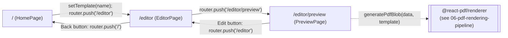

There are exactly three routes, all client components (`"use client"`), all reading and writing the same `useResumeStore`.

## `/` - HomePage (`src/app/page.tsx`)

Renders a grid of all 15 templates from `templateSchema.options` (the Zod enum in `src/lib/schema/templates.ts`), each as a `motion.button` with a staggered fade/slide-in entrance. Each button shows two stacked `next/image` layers of the same `/templates/jpg/<name>.jpg` file: a blurred, scaled-up background copy for visual fill, and a sharp `object-contain` copy on top. Clicking a template calls `setTemplate(name)` on the store, then `router.push("/editor")`.

## `/editor` - EditorPage (`src/app/editor/page.tsx`)

Renders three responsive layouts of the *same* `EditorPanelShell` (tab strip + template `Select` + Preview button + tab content), switched entirely by Tailwind breakpoint classes rather than separate route segments:

- **`lg:` and up** - `EditorPanelShell` centered with 5%-width side gutters and `Scales variant="compact"` decorating the outer edges
- **`md:` to `lg:`** - the same shell, full width, no gutters or `Scales`
- **below `md:`** - a distinct mobile layout: a minimal top bar with just a back arrow, the active tab's content directly below it, and `BottomNav` fixed to the bottom of the screen for switching between Basics/Sections/Design

The three `EditorTab` values (`"basics"` / `"sections"` / `"design"`) map to `BasicsForm`, `SummaryForm` + `SectionAccordion`, and `DesignPanel` respectively (see `05-editor-ui.mdx`). The template `Select` in the desktop shell and the one inside `DesignPanelPlaceholder` (mobile's Design tab) both write directly to `setTemplate`, so template choice is changeable from either the header or the Design tab.

## `/editor/preview` - PreviewPage (`src/app/editor/preview/page.tsx`)

On mount, dynamically imports `generatePdfBlob` from `@/lib/generate-pdf` (kept as a separate dynamic `import()` so the `@react-pdf/renderer` bundle - which is large - isn't loaded until the person actually reaches this screen), calls it with the current `data` and `template` from the store, and turns the resulting `Blob` into an object URL via `URL.createObjectURL`. Three states are tracked in a `GenState` union: `"loading"`, `"ready"` (with `blobUrl`), `"error"` (with a `message`).

- **Desktop/tablet** (`md:` and up) - the PDF is shown inline via `<iframe src={blobUrl}>`
- **Mobile** - browsers generally can't render a PDF inside an `iframe`, so a fallback panel offers "Open PDF" (`window.open(blobUrl, "_blank")`) and "Download PDF" buttons instead
- **Regenerate** re-runs `generate()` on demand (e.g. after going back to `/editor` and making a change, then returning)
- **Export PDF** creates a temporary `<a download="resume.pdf">` element and clicks it programmatically
- The object URL is revoked (`URL.revokeObjectURL`) in the `useEffect` cleanup, so navigating away or regenerating doesn't leak blob URLs

## No 404 / not-found handling

There is no custom `not-found.tsx` and no dynamic route segments anywhere in `src/app/` - every path is a fixed, literal route, so there's no unknown-parameter case to handle.
