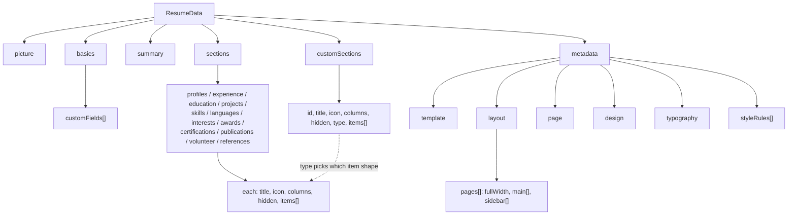

The entire resume - content, layout, and design - is one Zod-validated object, `ResumeData`, defined in `src/lib/schema/data.ts` (ported from Reactive Resume's `packages/schema`). Every editor form and every PDF template reads and writes some slice of this same object.

## Sections: 12 built-in types, 1 schema each

`sectionsSchema` fixes exactly 12 keys - `profiles`, `experience`, `education`, `projects`, `skills`, `languages`, `interests`, `awards`, `certifications`, `publications`, `volunteer`, `references` - each a `{ title, icon, columns, hidden, items: T[] }` shape (`baseSectionSchema` extended per type). `summary` is a sibling top-level field with a similar shape but a single `content` string instead of an `items` array. Every item type extends `baseItemSchema` (`{ id, hidden }`); most add a `website: itemWebsiteSchema` (a URL + label + `inlineLink` flag controlling whether the link renders inline on the item title or as a separate line - see `getInlineItemWebsiteUrl` / `shouldRenderSeparateItemWebsite` in `src/lib/pdf/templates/shared/section-links.ts`).

`experience` is the one section with nested structure: `experienceItemSchema` has a `roles: RoleItem[]` array (each `{ id, position, period, description }`) for showing career progression (promotions) within a single company, in addition to its own top-level `position`/`period` used when there's only one role.

## Custom sections

`customSections` is a flat array, independent of the 12 built-in `sections` keys. Each `CustomSection` has its own `id` (a UUID, used as its section identifier everywhere - see `04-state-persistence.mdx`) and a `type: CustomSectionType` (the same 12 built-in types, plus `"summary"` and `"cover-letter"`) that determines which item shape (`customSectionItemSchema`, a `z.union` of every item schema) its `items` should use. This is how the app supports "add your own section, name it whatever, pick which field layout it uses" - a custom section is really just a same-shaped, independently-titled instance of one of the 12 known section types (or a cover letter).

> ⚠️ Unclear: `customSectionItemSchema` puts `coverLetterItemSchema` before `summaryItemSchema` in its union specifically because both shapes have a `content` field and Zod's union picks the first match - the in-code comment calls this out directly as a deliberate ordering requirement, not an accident.

## Layout: which sections go where, on which page

`metadata.layout.pages` is an array of `{ fullWidth, main: string[], sidebar: string[] }`. Only the app ever populates a single page (`defaultResumeData`'s `pages` array has exactly one entry) - multi-page layout is present in the schema but not exposed anywhere in the editor UI documented in `05-editor-ui.mdx`. The `main`/`sidebar` arrays hold section identifiers: either one of the 12 built-in keys, `"summary"`, or a custom section's UUID. `reorderSections` (in the Zustand store) is what keeps a section's membership in `main` vs `sidebar` and its position within that array in sync when the person drags it in the editor.

## Design, typography, and page settings

- `metadata.page` - `gapX`/`gapY` (points), `marginX`/`marginY` (points), `format` (`"a4"` / `"letter"` / `"free-form"`), `locale` (one of 53 BCP-47 tags via `localeSchema` in `src/lib/utils/locale.ts`, used for RTL detection and CJK font-fallback decisions), plus three booleans hiding link underlines, item icons, and section-heading icons independently
- `metadata.design.colors` - `primary` / `text` / `background`, all `rgba(...)` strings
- `metadata.design.level` - controls how proficiency levels (skills, languages) render: `hidden`, `circle`, `square`, `rectangle`, `rectangle-full`, `progress-bar`, or `icon` (with an accompanying Phosphor `icon` name)
- `metadata.typography.body` / `.heading` - each a `fontFamily`, `fontWeights[]`, `fontSize`, `lineHeight`

## Style rules: per-section style overrides

`metadata.styleRules` is a more advanced override layer on top of the base design: each `StyleRule` targets either `"global"`, a `sectionType`, or one specific `sectionId`, and sets a `StyleIntent` (a constrained, PDF-safe subset of CSS-like properties - color, spacing, font size/weight, borders, text alignment, and so on) for one or more named `StyleSlot`s (`section`, `heading`, `item`, `text`, `link`, `icon`, `level`, and several `rich*` slots for rendered HTML content). `resolveStyleIntentForSlot` (`src/lib/schema/style-rules.ts`) finds every enabled rule matching a given slot and section, sorts them by specificity (`global` → `sectionType` → `sectionId`), and merges them so more specific rules win. This is consumed inside the PDF templates via `useSectionStyleRule` (`src/lib/pdf/templates/shared/context.tsx`) - see `06-pdf-rendering-pipeline.mdx`.

> ⚠️ Unclear: nothing under `src/components/editor/` currently reads or writes `metadata.styleRules` - the schema, resolver, and PDF-side consumption all exist and are wired together, but there is no visible editor UI for creating a style rule. It may be intended for a future "advanced styling" panel, or for JSON-level editing not exposed here.

## Defaults and the `onyx` fallback

`defaultResumeData()` (`src/lib/schema/defaults.ts`) wraps a `structuredClone` of a large constant object in `default.ts` - deliberately a function rather than a plain export, so that "reset to default" actions get an independent object each call and can't accidentally share references with a previous reset. The default template is `"onyx"`; `getTemplatePage` (`src/lib/pdf/templates/index.ts`) also falls back to `AzurillPage` for a template name that isn't in the `templatePages` map (which shouldn't happen in practice, since `Template` is a closed Zod enum, but the fallback exists defensively).
