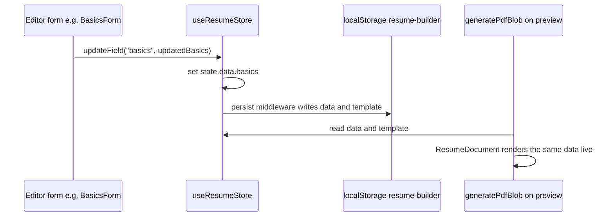

All editor state lives in one Zustand store, `useResumeStore` (`src/lib/store/resume.ts`), wrapped in Zustand's `persist` middleware. There is no React Context, no server state, and no other store in the app.

## What's persisted

`partialize` limits the persisted snapshot to `{ data, template }` only - no derived or transient UI state (like which accordion is open) is saved. The storage key is `"resume-builder"`; `version: 2` is set so future schema changes can run a `migrate` step.

## Store shape

`ResumeStore` exposes a flat action list rather than nested slices:

- **Bulk**: `setData`, `updateField` (patches one top-level `ResumeData` key), `setTemplate`, `resetToDefault`, `resetTab` (resets just `"basics"`, `"sections"`, or `"design"` back to `defaultResumeData()` without touching the rest)
- **Built-in sections**: `updateSection`, `upsertSectionItem`, `removeSectionItem`, `reorderSectionItems`, `reorderSections` (this last one repositions section IDs across both `main` and `sidebar` in one call - see below)
- **Custom sections**: `addCustomSection`, `removeCustomSection`, `updateCustomSection`, `upsertCustomSectionItem`, `removeCustomSectionItem`, `reorderCustomSectionItems`
- **Generic escape hatch**: `upsertGenericSectionItem` - a version of `upsertSectionItem` typed around `GenericSectionType` (every built-in section except `experience`, which has its own nested-roles shape) so the field-config-driven inline editors in `SectionAccordion` (see `05-editor-ui.mdx`) can write to any of the 11 generic section types through one shared code path instead of one per type

Every action follows the same immutable-update shape: `set((state) => ({ data: { ...state.data, ... } }))`, spreading only the parts of `data` that changed.

## `reorderSections`: keeping `main`/`sidebar` membership in sync with one drag

The editor's section list is a single visual list a person drags items within, but the underlying data splits sections between `layout.pages[0].main` and `layout.pages[0].sidebar`. `reorderSections(newOrder)` takes the new combined visual order, splits it back into `main`/`sidebar` buckets by checking each ID against the *previous* sidebar membership (`sidebarSet`), then uses a small `rebuild` helper to slot the reordered IDs back into each array in their new relative order - so dragging a section across the main/sidebar boundary both reorders it and reassigns which array it belongs to in one store update.

## Migrations

The `migrate` function runs two staged fixups keyed off `version`:

- **`version < 1`** - removes any section ID from `main` that's also present in `sidebar`, cleaning up resume data that predates the current main/sidebar split enforcement
- **`version < 2`** - ensures `"summary"` is present in either `main` or `sidebar` of the first page, prepending it to `main` if a pre-existing resume's layout doesn't mention it at all (older versions of the app may not have included summary as a placeable section)

Both fixups only touch `state.data.metadata.layout.pages[0]` and leave the rest of the persisted state untouched.

## No separate "completeness" tracking

The store tracks no derived progress or completion state. "How much of the resume is filled in" isn't stored anywhere - it's computed at render time instead, via `filterItems`/`hasVisibleItems` in `src/lib/pdf/templates/shared/filtering.ts`, which hide any item missing its primary title field (see `06-pdf-rendering-pipeline.mdx`).
