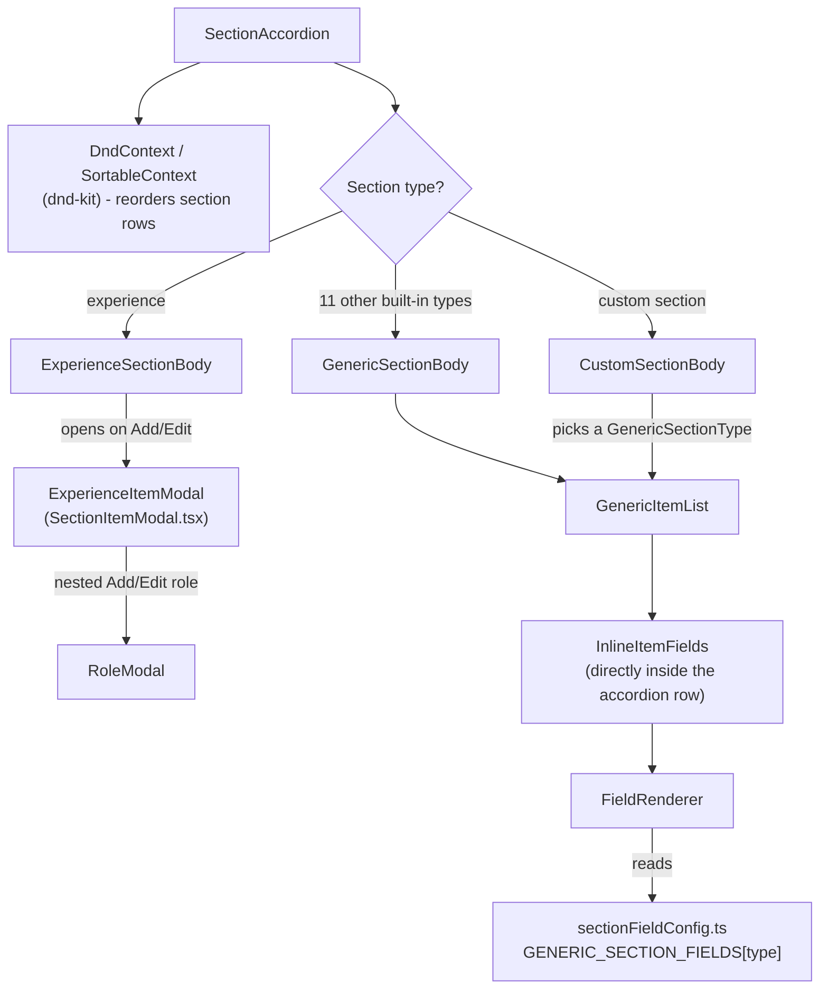

The Sections tab (`SummaryForm` + `SectionAccordion`) is the most structurally interesting part of the editor: it edits 13 conceptually different things (12 section types plus custom sections) through one shared, field-config-driven system rather than 13 separate hand-built forms.

## The field-config pattern

`src/components/editor/sectionFieldConfig.ts` defines `GENERIC_SECTION_FIELDS`, a `Record<GenericSectionType, FieldConfig[]>` naming, for each of the 11 generic section types (every built-in type except `experience`), exactly which fields to show and how - e.g. Skills gets `text` (name), `text` (proficiency), `level` (0-5 slider), `tags` (keywords), `icon`, `icon-color`; Languages gets just `text` (language), `text` (fluency), `level`. `FieldConfig` (`itemFields.tsx`) is a discriminated union over `kind`: `"text"`, `"textarea-rich"` (HTML content, rendered with a "Accepts HTML" hint), `"website"` (URL + label + inline-link checkbox), `"level"` (a 0-5 `LevelSlider`), `"tags"` (a `TagInput` chip editor), `"icon"` (a raw Phosphor icon-name text field), and `"icon-color"` (a `ColorField`). `FieldRenderer` switches on `field.kind` to render the right control and wire its `onChange` back to a patch function.

Because this is data-driven, adding a new field to an existing section type - or defining a brand-new custom section type from the 11 supported shapes - never requires new form markup, only a new `FieldConfig` entry.

## Why `experience` is the exception

Experience is the only section with a nested list (`roles`) inside each item, representing promotions/role changes within one company tenure. That doesn't fit the flat field-config model, so `ExperienceSectionBody` opens a dedicated `ExperienceItemModal` (in `SectionItemModal.tsx`) instead of rendering inline: the modal holds its own `draft` state for the experience item, and inside it, adding/editing a role opens a second, nested `RoleModal`. Saving the outer modal calls `upsertSectionItem("experience", draft)` on the store; saving a role only updates the modal's local `draft.roles` array until the outer modal itself is saved.

## Drag-and-drop, with a mobile fallback

Both section-level reordering (in `SectionAccordion`) and item-level reordering (in `GenericItemList` and `ExperienceSectionBody`) use `@dnd-kit`'s `DndContext` + `SortableContext`, with a `PointerSensor` activation constraint of 8px of movement (`DRAG_ACTIVATION_CONSTRAINT`) so accidental taps don't start a drag. Section rows use `rectSortingStrategy` (grid-aware); item rows use `verticalListSortingStrategy`. Because drag handles are awkward on touch, every draggable row also renders a `MoveButtons` pair (up/down chevrons) that's hidden on desktop (`md:hidden`) and shown on mobile as the primary reordering method there.

## Basics and Summary forms

`BasicsForm` and `SummaryForm` are conventional controlled forms - each reads its slice of `data` from the store and calls `updateField` on change, with no field-config layer since their fields are fixed and few. `BasicsForm` additionally handles the profile photo: file selection routes through `fileToResizedDataUrl` (`resizeImage.ts`), which reads the file as a data URL, loads it into an `Image`, downsamples it to at most `MAX_PHOTO_DIMENSION` (480px) on a `<canvas>`, and re-encodes it as a JPEG at `PHOTO_JPEG_QUALITY` (0.8) - so an uploaded photo is always stored compressed and inline as a `data:` URL, never as a separate file, keeping it inside the same `localStorage`-persisted `ResumeData` object.

## Design tab

`DesignPanel` is a flat set of controls patched directly into `metadata`: three `ColorField`s (primary/text/background, each backed by an `<input type="color">` plus the `rgba(...)` ⇄ hex conversion helpers in `colorConvert.ts`), a level-display type `Select`, font family `Select`s sourced from `fontList` (`src/lib/pdf/fonts.ts` - the same font catalog the PDF renderer registers fonts from, so every listed font is guaranteed renderable), and `Slider`s for font size, line height, margins, and gaps.

## Confirm-to-commit buttons

`ResetTabButton` and `DeleteSectionButton` share the same two-step pattern: the first click arms a "confirming" state (changing the button's label/color) and starts a 4-second (`CONFIRM_WINDOW_MS`) timer; a second click within that window commits the action; letting the timer lapse silently reverts to the unarmed state. This avoids a separate confirmation dialog for destructive actions while still requiring deliberate intent.

## Shared UI primitives

`src/components/ui/` holds `Button` (a `motion.button` with a `whileTap` scale-down and `"default"`/`"ghost"` variants), `Input`, `Select` (a native `<select>` with a custom chevron icon overlaid, since `appearance-none` strips the native one), `Slider` (a styled native range input with an optional adjacent value readout), `Switch` (a custom animated toggle built from a plain button + an animated inner `span`, not a native checkbox), and `Textarea`. All of them accept and merge a `className` prop via `cn()` (`clsx` + `tailwind-merge`, `src/components/ui/cn.ts`) so callers can extend or override the default Tailwind classes without specificity fights.

> ⚠️ Unclear: `src/lib/utils/style.ts` defines a second, byte-for-byte identical `cn()` helper (also `clsx` + `tailwind-merge`) ported from Reactive Resume's `packages/utils/src/style.ts`. Nothing in the app imports from `utils/style.ts` - every component uses `components/ui/cn.ts` instead. It appears to be leftover from the porting process rather than an active duplicate.
