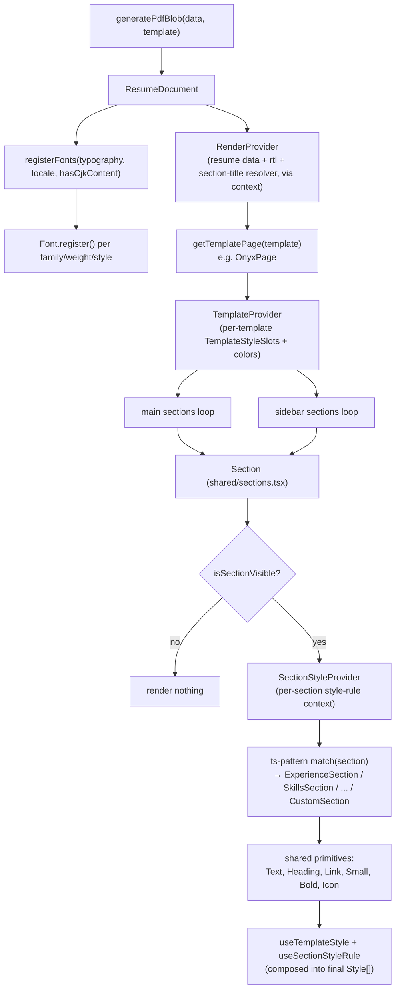

The PDF isn't a separate export path bolted onto an HTML preview - the exact same template React components produce both the on-screen preview (rendered inside the `<iframe>` on `/editor/preview`) and the downloaded file, because both are just two different consumers of the one `Blob` returned by `generatePdfBlob`. Everything here renders through `@react-pdf/renderer`'s own primitive components (`Document`, `Page`, `View`, `Text`, `Image`, `Link`), not HTML/CSS.

## Entry point: `generatePdfBlob`

`src/lib/generate-pdf.tsx` is a two-line bridge: it builds a `<ResumeDocument data={data} template={template} resolveSectionTitle={englishSectionTitleResolver} />` element and hands it to `@react-pdf/renderer`'s `pdf(element).toBlob()`. `englishSectionTitleResolver` is the app's only `SectionTitleResolver` implementation - it just falls back to a section's default English title (or its raw ID) whenever the section's own `title` field is blank, since this app has no localized-title lookup table of its own.

## `ResumeDocument`: fonts, then pages

`src/lib/pdf/document.tsx` does three things before rendering any content:

1. Looks up the right template page component via `getTemplatePage(template)`.
2. Detects whether any resume content contains CJK characters (`resumeContentContainsCJK`) - checked across `basics`, `summary`, `sections`, and `customSections`.
3. Calls `registerFonts(typography, locale, hasCjkContent)`, which returns a `PdfTypography` - the same typography settings, but with `fontFamily` possibly widened from a single string to a `string[]` fallback stack (see below).

It then wraps every page in a `RenderProvider` (supplying the resume data, the `rtl` flag from `isRTL(locale)`, and the section-title resolver via React context - `useRender()` is how every deeper component reads resume content) and a `Document` with PDF metadata (title/author/creator from `basics.name`, subject from `basics.headline`, `producer: "Reactive Resume"`). Each entry in `metadata.layout.pages` renders as one `TemplatePageComponent`.

## Font registration and CJK fallback

`src/lib/pdf/fonts.ts` ports Reactive Resume's font catalog wholesale from a JSON file (`fonts-data.json`, copied verbatim from the upstream `webfontlist.json`) rather than depending on an internal monorepo package that isn't available standalone. `registerFonts` (`src/lib/pdf/hooks/use-register-fonts.ts`):

- Resolves the chosen body/heading font family to one `@react-pdf/renderer` can actually load - direct catalog match, then a legacy alias table (e.g. `"Arial"` → `"Arimo"`, `"Times New Roman"` → `"Times-Roman"`, kept for resumes saved under font names the browser used to resolve but that `@react-pdf/renderer` v5.1+ doesn't recognize directly), then a hardcoded `"IBM Plex Serif"` fallback.
- Registers each family/weight/style combination with `Font.register` exactly once (a module-level `registeredFontVariants` `Set` deduplicates across multiple PDF generations in the same session).
- If the locale is CJK (`zh-CN`, `zh-TW`, `ja-JP`, `ko-KR`) or the content itself contains CJK characters (checked with the `cjk-regex` package), registers a Noto Sans/Serif SC fallback font too, and widens the typography's `fontFamily` to a two-element array so `@react-pdf/renderer`'s textkit can substitute the fallback glyph-by-glyph for characters the primary font lacks - preserving bold/italic styling in that fallback text rather than silently dropping formatting.
- Also sets a custom `Font.registerHyphenationCallback`: for CJK text, hyphenation is disabled per-character (each character becomes its own unbreakable unit joined by a zero-width non-joiner) since CJK text doesn't hyphenate the way Latin scripts do; for everything else the callback is a no-op passthrough.

## Templates: 15 page components sharing one primitive/section layer

Each of the 15 files under `src/lib/pdf/templates/<name>/<Name>Page.tsx` is a `TemplatePage` (`(props: { page, pageIndex }) => ReactElement`) registered in `templatePages` (`templates/index.ts`). A template page typically:

1. Computes its own `colors: TemplateColorRoles` (foreground/background/primary, optionally distinct sidebar foreground/background) and `styles: TemplateStyleSlots` (a big object of style values or `(context) => style` functions, keyed by slot name - `text`, `heading`, `sectionHeading`, `item`, `levelContainer`, and so on) via a local `useXTemplate()` hook.
2. Renders a `<Page>` sized via `getTemplatePageSize`/`getTemplatePageMinHeightStyle` (A4 fixed size, US Letter fixed size, or a fixed-width/growable-height "free-form" page).
3. Wraps everything in `<TemplateProvider styles={styles} colors={colors}>`, which makes those style slots available to every primitive underneath via React context.
4. Renders its own template-specific `<Header>` (name, headline, contact list, optional picture) only on the first page (`pageIndex === 0`).
5. Filters `page.main`/`page.sidebar` through `filterSections` (drops any section that's hidden, has no visible items, or - for `summary` - has empty content), then maps the survivors through the shared `<Section section={id} placement="main" | "sidebar" />` component.

`getSectionItemsLayout`/`getSectionItemRows` (`shared/columns.ts`) handle a section's `columns` setting (1-6): at 1 column, items stack in a single flex column; above that, items are chunked into rows and laid out with `flexBasis`/`flexGrow` so they distribute evenly, and `shouldUseSectionTimeline` additionally gates whether a template's optional vertical-timeline visual treatment (a `TemplateFeatures.sectionTimeline` flag) applies - it only ever applies to single-column sections placed in the main column.

## The shared `Section` dispatcher

`src/lib/pdf/templates/shared/sections.tsx` (981 lines) is the one file every template routes through for actual content rendering. Its exported `Section` component:

1. Bails out early (`return null`) if `isSectionVisible` (`shared/filtering.ts`) says the section has nothing to show.
2. Wraps its output in a `TemplatePlacementProvider` (so nested primitives know whether they're in `"main"` or `"sidebar"`, letting e.g. sidebar-specific colors apply) and a `SectionStyleProvider` (so `useSectionStyleRule` inside primitives can look up matching `metadata.styleRules` for this specific section).
3. Uses `ts-pattern`'s `match(section).with(...).otherwise(...)` to dispatch to one of 12 built-in per-type components (`ExperienceSection`, `SkillsSection`, `EducationSection`, ...) or, for anything not matching a built-in key, `CustomSection` - which looks the ID up in `data.customSections`, then does a *second* `match` on the custom section's `type` to reuse the exact same per-type components (just pointed at the custom section's own `sectionData` instead of `data.sections[...]`). This is why a custom "Certifications"-shaped section renders identically to the built-in Certifications section - it's the same `CertificationsSection` component either way.

## Style resolution: template defaults → style rules → inline

Every visual primitive (`Text`, `Heading`, `Link`, `Small`, `Bold`, `Icon`, all in `shared/primitives.tsx`) composes its final style array in the same fixed precedence order, via `composeStyles(...)`:

1. **Template-level style slot** (`useTemplateStyle("text")`, etc.) - the current template's own base styling for that role, possibly placement-aware (main vs. sidebar) via the slot's optional function form.
2. **Style-rule override** (`useSectionStyleRule("text")`, etc.) - the merged, specificity-resolved result from `resolveStyleIntentForSlot` (see `03-resume-data-model.mdx`) for the current section context, if any rule matches.
3. **Inline `style` prop**, if the calling code passed one directly.
4. **`safeTextStyle`** - a small fixed final style (from `shared/safe-text-style.ts`) applied last on every text-like primitive, functioning as a safety net baseline that later composed styles can still override via array order but that guards against style-less collapse.

Because style rules are resolved through this same context system rather than being template-specific, a style rule targeting `sectionType: "skills"` applies identically no matter which of the 15 templates is active.

## Rich text (HTML) content

Several item fields (`description`, `content`, and similar) are stored as HTML strings so the editor's `textarea-rich` fields can accept basic formatting. `src/lib/pdf/templates/shared/rich-text.tsx`, `rich-text-html.ts`, `rich-text-renderers.ts`, `rich-text-spacing.ts`, and `rich-text-stylesheet.ts` together parse that HTML (via `node-html-parser` and `react-pdf-html`) and re-render it using the same `richParagraph`/`richList`/`richLink`/`richBold`/`richMark` style slots as everything else, so pasted-in formatting still respects the active template's typography and the section's style rules rather than carrying its own hardcoded look.
